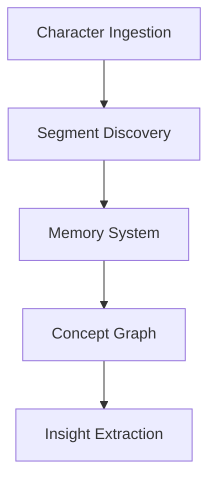
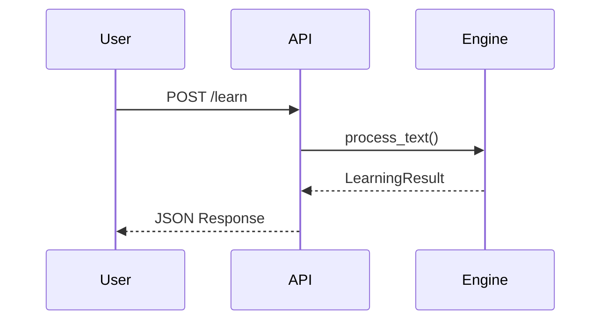

# Brain AI Documentation System

This directory contains the complete documentation system for Brain AI, built with [mdBook](https://github.com/rust-lang/mdBook) and enhanced with custom styling, interactive features, and automated generation tools.

## 📚 Documentation Structure

```
docs/
├── book.toml              # mdBook configuration
├── src/                   # Documentation source files
│   ├── SUMMARY.md         # Table of contents
│   ├── introduction.md    # Main introduction
│   ├── getting-started/   # Installation and setup guides
│   ├── architecture/      # System architecture documentation
│   ├── components/        # Individual component documentation
│   ├── api/              # API reference and guides
│   ├── python/           # Python bindings documentation
│   ├── deployment/       # Deployment guides
│   ├── development/      # Development and contributing guides
│   ├── examples/         # Code examples and tutorials
│   ├── reference/        # Reference materials
│   └── appendices/       # Additional resources
├── theme/                # Custom styling and JavaScript
│   ├── custom.css        # Enhanced styling
│   └── custom.js         # Interactive features
├── book/                 # Generated HTML output (git-ignored)
└── backup/               # Documentation backups
```

## 🚀 Quick Start

### Prerequisites

- **Rust 1.70+** with `cargo`
- **mdBook** and plugins
- **Git** for version control

### Installation

```bash
# Install mdBook and plugins
cargo install mdbook mdbook-mermaid mdbook-toc

# Or use the automated script
../scripts/generate-docs.sh build
```

### Building Documentation

```bash
# Build documentation
mdbook build

# Serve locally for development
mdbook serve --hostname 0.0.0.0 --port 3000

# Open browser to http://localhost:3000
```

### Using the Automation Script

The project includes a comprehensive documentation generation script:

```bash
# Full documentation generation
../scripts/generate-docs.sh full

# Build only
../scripts/generate-docs.sh build

# Serve locally
../scripts/generate-docs.sh serve

# Deploy to GitHub Pages
../scripts/generate-docs.sh deploy github-pages

# Show help
../scripts/generate-docs.sh help
```

## 📖 Documentation Features

### Enhanced Styling

- **Custom CSS**: Professional Brain AI branding and colors
- **Responsive Design**: Optimized for desktop and mobile
- **Dark Mode**: Full dark mode support
- **Interactive Elements**: Hover effects and smooth transitions

### Interactive Features

- **Copy Buttons**: One-click code copying
- **API Method Styling**: Automatic HTTP method highlighting
- **Status Badges**: Visual status indicators
- **Smooth Scrolling**: Enhanced navigation experience
- **Keyboard Shortcuts**: `Ctrl/Cmd + K` for search focus

### Mermaid Diagrams

The documentation supports Mermaid diagrams for visual architecture representation:



### Code Examples

All code examples include:
- Syntax highlighting
- Copy-to-clipboard functionality
- Runnable examples with instructions
- Multiple language support (Rust, Python, JavaScript, Bash)

## 🔧 Configuration

### mdBook Configuration

The `book.toml` file contains comprehensive configuration:

```toml
[book]
title = "Brain AI Documentation"
authors = ["Brain AI Development Team"]
description = "Complete documentation for the Brain AI cognitive architecture"

[preprocessor.mermaid]
command = "mdbook-mermaid"

[preprocessor.toc]
command = "mdbook-toc"

[output.html]
default-theme = "navy"
additional-css = ["theme/custom.css"]
additional-js = ["theme/custom.js"]
```

### Custom Styling

The documentation uses CSS custom properties for consistent theming:

```css
:root {
    --brain-primary: #2563eb;
    --brain-secondary: #7c3aed;
    --brain-accent: #06b6d4;
    --brain-gradient: linear-gradient(135deg, var(--brain-primary), var(--brain-secondary));
}
```

## 📝 Writing Documentation

### File Organization

- **One topic per file**: Keep files focused on single topics
- **Logical hierarchy**: Use the directory structure to organize content
- **Cross-references**: Link related content extensively
- **Examples**: Include practical examples for all concepts

### Markdown Standards

#### Headers

Use descriptive headers with proper hierarchy:

```markdown
# Main Topic (H1 - used for page titles)
## Major Section (H2)
### Subsection (H3)
#### Detail Section (H4)
```

#### Code Blocks

Always specify the language for syntax highlighting:

```markdown
```rust
fn main() {
    println!("Hello, Brain AI!");
}
```

```bash
cargo run --example basic_usage
```

```python
import brain_ai
engine = brain_ai.BrainEngine()
```
```

#### API Documentation

Document APIs with consistent format:

```markdown
### `learn_from_text(text: &str) -> Result<LearningResult, BrainError>`

Processes text through the character ingestion engine.

**Parameters:**
- `text`: Input text to learn from

**Returns:**
- `Ok(LearningResult)`: Success with learning statistics
- `Err(BrainError)`: Error during processing

**Example:**
```rust
let result = engine.learn_from_text("Hello, world!")?;
println!("Learned {} segments", result.segments_count);
```
```

#### Callout Boxes

Use emojis to create automatic callout boxes:

```markdown
🎉 **Success**: This indicates successful completion

⚠️ **Warning**: This indicates important warnings

ℹ️ **Note**: This provides additional information

❌ **Error**: This indicates error conditions
```

### Diagrams and Visuals

#### Mermaid Diagrams

Use Mermaid for system diagrams:

```markdown

```

#### ASCII Diagrams

For simple diagrams, use ASCII art:

```
Input Text → Character Ingestion → Segment Discovery → Memory Storage
     ↓              ↓                    ↓               ↓
  Raw chars    Predictions          Patterns         Stored info
```

## 🔄 Automated Documentation

### Source Code Integration

The documentation system automatically extracts:

- **API Documentation**: From Rust doc comments
- **Code Examples**: From the `examples/` directory
- **Module Structure**: From source code organization

### Continuous Integration

Set up automated documentation builds:

```yaml
# .github/workflows/docs.yml
name: Documentation

on:
  push:
    branches: [ main ]
  pull_request:
    branches: [ main ]

jobs:
  docs:
    runs-on: ubuntu-latest
    steps:
    - uses: actions/checkout@v2
    - name: Install Rust
      uses: actions-rs/toolchain@v1
      with:
        toolchain: stable
    - name: Install mdBook
      run: cargo install mdbook mdbook-mermaid mdbook-toc
    - name: Build documentation
      run: scripts/generate-docs.sh build
    - name: Deploy to GitHub Pages
      if: github.ref == 'refs/heads/main'
      run: scripts/generate-docs.sh deploy github-pages
```

## 🚀 Deployment

### GitHub Pages

Deploy to GitHub Pages automatically:

```bash
# Deploy to GitHub Pages
../scripts/generate-docs.sh deploy github-pages
```

This will:
1. Build the documentation
2. Create/update the `gh-pages` branch
3. Push the built documentation
4. Configure GitHub Pages settings

### Netlify

For Netlify deployment:

```bash
# Prepare for Netlify
../scripts/generate-docs.sh deploy netlify
```

This creates a `netlify.toml` configuration file.

### Local Deployment

For local sharing:

```bash
# Deploy locally
../scripts/generate-docs.sh deploy local
```

This copies documentation to `~/brain-ai-docs/`.

## 🛠 Maintenance

### Regular Updates

1. **Weekly**: Update examples and API documentation
2. **Monthly**: Review and update architecture diagrams
3. **Per Release**: Update version-specific information
4. **As Needed**: Add new features and components

### Quality Assurance

```bash
# Validate documentation
../scripts/generate-docs.sh validate

# Check for broken links
linkchecker docs/book/index.html

# Spell check (if available)
aspell check docs/src/**/*.md
```

### Backup and Recovery

```bash
# Create backup
../scripts/generate-docs.sh backup

# List backups
ls docs/backup/

# Restore from backup
../scripts/generate-docs.sh restore docs/backup/docs_backup_20241221_120000.tar.gz
```

## 🎯 Best Practices

### Content Guidelines

1. **User-Focused**: Write for developers who will use Brain AI
2. **Progressive Disclosure**: Start simple, add complexity gradually
3. **Examples First**: Show working code before explaining theory
4. **Consistent Voice**: Maintain professional but approachable tone
5. **Regular Updates**: Keep content current with code changes

### Technical Guidelines

1. **Performance**: Optimize images and minimize large files
2. **Accessibility**: Use proper heading hierarchy and alt text
3. **Mobile-Friendly**: Test on mobile devices
4. **Cross-Platform**: Ensure compatibility across browsers
5. **SEO-Friendly**: Use descriptive titles and meta descriptions

### Collaboration Guidelines

1. **Review Process**: All documentation changes should be reviewed
2. **Version Control**: Use meaningful commit messages
3. **Issue Tracking**: Link documentation to relevant issues
4. **Feedback Loop**: Collect and act on user feedback
5. **Style Consistency**: Follow established patterns

## 🔍 Troubleshooting

### Common Issues

#### mdBook Build Failures

```bash
# Clear cache and rebuild
rm -rf docs/book
mdbook clean
mdbook build
```

#### Missing Dependencies

```bash
# Install all required tools
cargo install mdbook mdbook-mermaid mdbook-toc
```

#### Mermaid Diagrams Not Rendering

```bash
# Verify mdbook-mermaid installation
mdbook-mermaid --version

# Check book.toml configuration
grep -A 2 "\[preprocessor.mermaid\]" book.toml
```

#### Broken Links

```bash
# Check for broken internal links
grep -r "\](\./" docs/src/

# Validate external links
linkchecker docs/book/index.html
```

### Getting Help

- **Documentation Issues**: Create GitHub issues with the `documentation` label
- **mdBook Help**: Check the [mdBook Guide](https://rust-lang.github.io/mdBook/)
- **Mermaid Help**: See [Mermaid Documentation](https://mermaid-js.github.io/mermaid/)
- **Community**: Join discussions in GitHub Discussions

## 📊 Analytics and Metrics

### Documentation Metrics

Track documentation effectiveness:

- **Page Views**: Monitor popular sections
- **User Feedback**: Collect ratings and comments
- **Issue Reports**: Track documentation-related issues
- **Contribution Stats**: Monitor documentation contributions

### Improvement Areas

Regularly assess:

- **Outdated Content**: Identify stale information
- **Missing Topics**: Find gaps in coverage
- **User Pain Points**: Address common questions
- **Performance Issues**: Optimize slow-loading pages

---

## 🎉 Contributing

We welcome contributions to improve the Brain AI documentation! Please see the [Contributing Guide](src/development/contributing.md) for detailed information on:

- Setting up the development environment
- Documentation standards and style guide
- Review process and quality assurance
- Deployment and maintenance procedures

Thank you for helping make Brain AI documentation better! 🧠✨ 