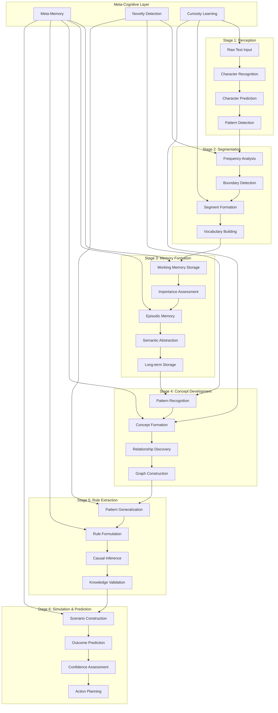
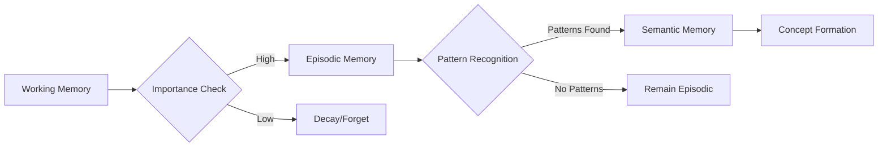

# Cognitive Pipeline

The Brain AI cognitive pipeline represents the flow of information processing that mirrors human-like cognitive development. This document details how raw input transforms into knowledge, understanding, and actionable insights through multiple processing stages.

## Overview

Brain AI's cognitive pipeline is designed to process information through increasingly sophisticated levels of abstraction, similar to how human cognition develops from basic perception to complex reasoning.



## Stage 1: Perception and Character Processing

### Character Recognition and Prediction

The cognitive journey begins with the most fundamental level of text understanding - individual characters.

**Process Flow:**
1. **Input Reception**: Raw text is received character by character
2. **Context Building**: Previous characters provide context for prediction
3. **Pattern Matching**: Character sequences are matched against learned patterns
4. **Confidence Scoring**: Each prediction receives a confidence score
5. **Learning Update**: Prediction accuracy updates internal models

**Key Components:**
- **CharacterPredictor**: GRU-based neural network for character prediction
- **CharacterVocab**: Dynamic vocabulary that grows with new characters
- **Context Window**: Sliding window of recent characters for context

**Example Process:**
```
Input: "The cat s"
Context: ["T", "h", "e", " ", "c", "a", "t", " ", "s"]
Prediction: "a" (confidence: 0.85), "i" (confidence: 0.12), "o" (confidence: 0.03)
Learning: If next character is "a", strengthen "cat s" → "a" pattern
```

### Pattern Detection

As character prediction improves, patterns emerge naturally:

**Detection Mechanisms:**
- **Frequency Analysis**: Tracks how often character sequences appear
- **Entropy Calculation**: Measures predictability of character transitions
- **Context Sensitivity**: Considers surrounding characters for pattern validation
- **Temporal Patterns**: Recognizes patterns that emerge over time

## Stage 2: Segmentation and Vocabulary Building

### Dynamic Segmentation

Brain AI discovers meaningful segments without pre-defined word boundaries:

**Segmentation Process:**
1. **Frequency Tracking**: Monitor character sequence frequencies
2. **Boundary Detection**: Identify natural breaking points using entropy
3. **Segment Validation**: Confirm segments through prediction improvement
4. **Vocabulary Integration**: Add validated segments to dynamic vocabulary
5. **Usage Monitoring**: Track segment usage and effectiveness

**BPE-Style Algorithm:**
```rust
// Simplified segmentation logic
for sequence in character_sequences {
    if sequence.frequency > min_threshold {
        if entropy_at_boundaries(sequence) > entropy_threshold {
            if improves_prediction(sequence) {
                add_to_vocabulary(sequence);
                update_usage_stats(sequence);
            }
        }
    }
}
```

### Vocabulary Evolution

The vocabulary continuously evolves based on usage and effectiveness:

**Evolution Mechanisms:**
- **Segment Promotion**: Frequently used character sequences become segments
- **Segment Demotion**: Rarely used segments are pruned
- **Segment Merging**: Related segments can be combined
- **Segment Splitting**: Overly general segments can be specialized

## Stage 3: Memory Formation and Consolidation

### Working Memory Processing

Information first enters working memory for immediate processing:

**Working Memory Characteristics:**
- **Limited Capacity**: Typically 1000 items (configurable)
- **Priority-Based**: High-importance items stay longer
- **Temporal Decay**: Unused items fade over time
- **Active Processing**: Items can be manipulated and combined

**Processing Steps:**
1. **Intake**: New information enters with priority score
2. **Integration**: Attempts to connect with existing memories
3. **Evaluation**: Assesses importance and relevance
4. **Retention Decision**: Determines if information should be retained

### Memory Consolidation

Important information moves from working memory to long-term storage:

**Consolidation Process:**


**Consolidation Criteria:**
- **Frequency**: How often the information is accessed
- **Recency**: How recently the information was used
- **Importance**: Explicit importance scores
- **Connections**: How well it connects to existing knowledge

### Memory Types and Their Roles

**Working Memory:**
- Temporary storage for active processing
- Limited capacity with priority-based eviction
- Real-time integration with ongoing cognition

**Episodic Memory:**
- Specific events and experiences
- Temporal context and relationships
- Source of patterns for semantic abstraction

**Semantic Memory:**
- Abstract knowledge and concepts
- General rules and relationships
- Foundation for reasoning and prediction

## Stage 4: Concept Development and Graph Construction

### Concept Formation

Abstract concepts emerge from patterns in memory:

**Formation Process:**
1. **Pattern Recognition**: Identify recurring themes in memories
2. **Abstraction**: Extract common features across instances
3. **Concept Creation**: Form new concept nodes in the graph
4. **Relationship Mapping**: Connect concepts based on co-occurrence
5. **Validation**: Confirm concept utility through usage

**Example Concept Formation:**
```
Episodic Memories:
- "The cat sat on the mat"
- "A cat chased the mouse"
- "Cats are good pets"

Pattern Recognition:
- "cat" appears in multiple contexts
- Associated with actions (sat, chased)
- Associated with properties (good pets)

Concept Formation:
- Create concept node "CAT"
- Properties: [animal, pet, predator]
- Relationships: [chases → MOUSE, sits_on → MAT, is_a → PET]
```

### Relationship Discovery

Concepts are connected through various relationship types:

**Relationship Types:**
- **IS_A**: Taxonomic relationships (cat IS_A animal)
- **PART_OF**: Compositional relationships (tail PART_OF cat)
- **CAUSES**: Causal relationships (rain CAUSES wet)
- **SIMILAR_TO**: Similarity relationships (cat SIMILAR_TO dog)
- **OPPOSITE_OF**: Antonym relationships (hot OPPOSITE_OF cold)
- **USED_FOR**: Functional relationships (key USED_FOR opening)

### Hebbian Learning

Relationships strengthen through repeated co-activation:

**Strengthening Mechanism:**
```rust
// Simplified Hebbian learning
fn update_relationship_strength(concept_a: &Concept, concept_b: &Concept) {
    if concept_a.is_active() && concept_b.is_active() {
        let relationship = get_relationship(concept_a, concept_b);
        relationship.weight += learning_rate * activation_product;
        relationship.last_used = current_time();
    }
}
```

**Decay Mechanism:**
- Unused relationships gradually weaken
- Very weak relationships are pruned
- Strengthening can overcome decay

## Stage 5: Rule Extraction and Knowledge Formation

### Pattern Generalization

Specific observations become general rules:

**Generalization Process:**
1. **Instance Collection**: Gather multiple similar examples
2. **Common Feature Extraction**: Identify shared characteristics
3. **Rule Formulation**: Express patterns as general rules
4. **Exception Handling**: Account for cases that don't fit
5. **Confidence Assessment**: Assign confidence based on supporting evidence

**Example Rule Formation:**
```
Observations:
- "Birds fly in the sky"
- "Eagles soar high above"
- "Sparrows flutter between trees"

Pattern: [BIRD] + [FLY/SOAR/FLUTTER] + [IN/ABOVE] + [LOCATION]

Rule: "Birds typically move through the air"
Confidence: 0.85
Exceptions: ["Penguins don't fly", "Ostriches run instead"]
```

### Causal Inference

Brain AI develops understanding of cause-and-effect relationships:

**Inference Mechanisms:**
- **Temporal Correlation**: Events that frequently occur in sequence
- **Spatial Correlation**: Events that occur in similar contexts
- **Intervention Analysis**: Understanding what changes when actions are taken
- **Counterfactual Reasoning**: Considering what would happen if conditions were different

### Knowledge Validation

Rules and knowledge are continuously validated:

**Validation Methods:**
- **Prediction Accuracy**: How well rules predict outcomes
- **Consistency Checking**: Ensuring rules don't contradict each other
- **Evidence Accumulation**: Gathering supporting or contradicting evidence
- **Peer Review**: Comparing with other learned rules

## Stage 6: Simulation and Prediction

### Scenario Construction

Brain AI can construct and explore hypothetical scenarios:

**Construction Process:**
1. **Initial State Setup**: Define starting conditions
2. **Rule Application**: Apply learned rules to predict changes
3. **Branching Exploration**: Consider multiple possible outcomes
4. **Constraint Validation**: Ensure scenarios remain plausible
5. **Outcome Assessment**: Evaluate final states and their likelihood

### Prediction and Planning

The system can predict outcomes and plan actions:

**Prediction Pipeline:**


**Planning Capabilities:**
- **Goal-Oriented**: Work backward from desired outcomes
- **Multi-Step**: Plan sequences of actions
- **Contingency Planning**: Prepare for multiple scenarios
- **Risk Assessment**: Evaluate potential negative outcomes

## Meta-Cognitive Layer

### Meta-Memory Awareness

Brain AI develops awareness of its own knowledge:

**Meta-Memory Functions:**
- **Knowledge Confidence**: Understanding certainty levels
- **Knowledge Gaps**: Recognizing what it doesn't know
- **Learning Efficiency**: Tracking how well it learns
- **Knowledge Quality**: Assessing reliability of information

### Novelty Detection

The system actively identifies new or unexpected information:

**Detection Methods:**
- **Statistical Deviation**: Information that doesn't match learned patterns
- **Prediction Failure**: When predictions are consistently wrong
- **Context Mismatch**: Familiar elements in unfamiliar combinations
- **Temporal Anomalies**: Events occurring at unexpected times

### Curiosity-Driven Learning

Brain AI prioritizes learning based on curiosity and gaps:

**Curiosity Mechanisms:**
- **Information Gap Theory**: Seek information to fill knowledge gaps
- **Prediction Error Minimization**: Focus on areas with poor prediction
- **Novelty Seeking**: Prioritize new and unusual information
- **Optimal Challenge**: Seek information that's neither too easy nor too hard

## Pipeline Optimization

### Adaptive Processing

The pipeline adapts based on performance and context:

**Adaptation Mechanisms:**
- **Dynamic Thresholds**: Adjust sensitivity based on performance
- **Resource Allocation**: Distribute processing power where needed most
- **Learning Rate Adjustment**: Modify learning speed based on progress
- **Pipeline Reconfiguration**: Change processing order for efficiency

### Performance Monitoring

Each stage is continuously monitored for optimization:

**Monitoring Metrics:**
- **Processing Speed**: Time taken for each stage
- **Accuracy**: Correctness of predictions and classifications
- **Memory Usage**: Resource consumption at each stage
- **Learning Progress**: Rate of knowledge acquisition

### Error Handling and Recovery

The pipeline includes robust error handling:

**Error Recovery Strategies:**
- **Graceful Degradation**: Continue processing with reduced capability
- **Rollback Mechanisms**: Revert to previous stable states
- **Alternative Pathways**: Use backup processing methods
- **Error Learning**: Learn from errors to prevent repetition

## Integration with External Systems

### API Integration

The cognitive pipeline can be accessed through various interfaces:

**Integration Points:**
- **Real-time Processing**: Stream processing for live input
- **Batch Processing**: Efficient processing of large datasets
- **Interactive Queries**: Direct access to specific pipeline stages
- **Monitoring Interfaces**: Real-time pipeline status and metrics

### Customization and Extension

The pipeline is designed for customization:

**Extension Mechanisms:**
- **Plugin Architecture**: Add custom processing stages
- **Configuration Parameters**: Tune behavior for specific use cases
- **Custom Models**: Integrate domain-specific models
- **Callback Systems**: Hook into pipeline events

This cognitive pipeline represents a sophisticated approach to artificial intelligence that mirrors human cognitive development while providing the flexibility and power needed for diverse applications. Each stage builds upon the previous ones, creating an emergent intelligence that can learn, reason, and adapt to new situations.

## Future Developments

The cognitive pipeline continues to evolve with ongoing research:

**Planned Enhancements:**
- **Multi-Modal Processing**: Integration of visual and auditory inputs
- **Emotional Modeling**: Understanding and simulating emotional responses
- **Social Cognition**: Modeling interactions with other agents
- **Creative Synthesis**: Generating novel combinations of existing knowledge

This pipeline provides the foundation for Brain AI's cognitive capabilities and serves as a platform for future cognitive architecture research and development.
