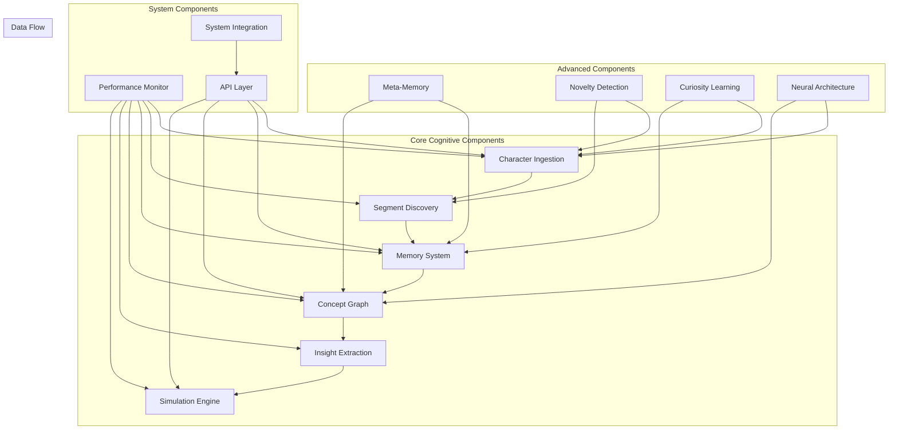

# Component Interactions

Brain AI's cognitive capabilities emerge from the sophisticated interactions between its various components. This document details how components communicate, share data, and coordinate to create a unified cognitive system.

## Interaction Overview

The Brain AI system consists of multiple specialized components that work together through well-defined interfaces and communication patterns. Each component has specific responsibilities while contributing to the overall cognitive process.



## Core Component Interactions

### Character Ingestion ↔ Segment Discovery

The character ingestion engine works closely with segment discovery to identify meaningful text units.

**Interaction Pattern:**
```rust
// Character Ingestion provides character-level predictions
let char_predictions = character_ingestion.predict_next_chars(context);

// Segment Discovery uses predictions to identify boundaries
let segment_boundaries = segment_discovery.find_boundaries(
    &char_predictions,
    &context
);

// Segment Discovery provides feedback to improve character prediction
character_ingestion.update_with_segment_feedback(segment_boundaries);
```

**Data Exchange:**
- **CI → SD**: Character predictions, confidence scores, context windows
- **SD → CI**: Segment boundaries, validation feedback, improvement suggestions

**Coordination Mechanisms:**
- **Shared Vocabulary**: Both components maintain references to the dynamic vocabulary
- **Feedback Loops**: Segment discovery success improves character prediction accuracy
- **Performance Metrics**: Shared metrics for boundary detection accuracy

### Segment Discovery ↔ Memory System

Discovered segments are processed and stored by the memory system for later retrieval and pattern recognition.

**Interaction Pattern:**
```rust
// Segment Discovery identifies new segments
let new_segments = segment_discovery.discover_segments(text_input);

// Memory System processes and stores segments
for segment in new_segments {
    let importance = memory_system.assess_importance(&segment);
    if importance > threshold {
        memory_system.store_segment(segment, importance);
    }
}

// Memory System provides context for segment validation
let context = memory_system.get_context_for_segment(&segment);
segment_discovery.validate_with_context(segment, context);
```

**Data Exchange:**
- **SD → MS**: New segments, usage statistics, context information
- **MS → SD**: Historical patterns, validation context, importance scores

**Coordination Mechanisms:**
- **Priority Queues**: High-priority segments get faster processing
- **Context Sharing**: Memory provides historical context for segment validation
- **Statistics Tracking**: Shared tracking of segment usage and effectiveness

### Memory System ↔ Concept Graph

The memory system feeds patterns to the concept graph, which forms abstract concepts and relationships.

**Interaction Pattern:**
```rust
// Memory System identifies patterns for concept formation
let patterns = memory_system.identify_patterns(similarity_threshold);

// Concept Graph creates concepts from patterns
for pattern in patterns {
    let concept = concept_graph.create_concept_from_pattern(pattern);
    concept_graph.add_concept(concept);
}

// Concept Graph provides semantic context back to memory
let semantic_context = concept_graph.get_semantic_context(memory_item);
memory_system.enrich_with_semantic_context(memory_item, semantic_context);
```

**Data Exchange:**
- **MS → CG**: Pattern data, concept candidates, relationship evidence
- **CG → MS**: Semantic enrichment, concept definitions, relationship mappings

**Coordination Mechanisms:**
- **Concept Validation**: Memory validates concept utility through usage patterns
- **Semantic Enrichment**: Concepts provide meaning to memory items
- **Relationship Discovery**: Shared identification of concept relationships

### Concept Graph ↔ Simulation Engine

The concept graph provides the knowledge base for the simulation engine's scenario modeling.

**Interaction Pattern:**
```rust
// Simulation Engine queries concept graph for scenario rules
let rules = concept_graph.get_rules_for_scenario(&scenario_context);

// Simulation Engine runs scenarios using concept relationships
let simulation_result = simulation_engine.run_scenario(
    &initial_state,
    &rules,
    &concept_relationships
);

// Simulation results validate and strengthen concept relationships
concept_graph.update_relationships_from_simulation(simulation_result);
```

**Data Exchange:**
- **CG → SE**: Concept definitions, relationship weights, inference rules
- **SE → CG**: Simulation outcomes, relationship validation, new rule discoveries

**Coordination Mechanisms:**
- **Rule Extraction**: Concepts provide rules for simulation logic
- **Outcome Validation**: Simulation results validate concept relationships
- **Learning Integration**: Successful simulations strengthen concept connections

## Advanced Component Interactions

### Meta-Memory Integration

Meta-memory provides awareness and control over the memory system's operations.

**Interaction Pattern:**
```rust
// Meta-Memory monitors memory system performance
let memory_stats = meta_memory.analyze_memory_performance();

// Meta-Memory provides guidance for memory operations
let consolidation_strategy = meta_memory.suggest_consolidation_strategy();
memory_system.apply_consolidation_strategy(consolidation_strategy);

// Meta-Memory tracks knowledge confidence
let confidence_map = meta_memory.assess_knowledge_confidence();
concept_graph.update_concept_confidence(confidence_map);
```

**Key Interactions:**
- **Memory Monitoring**: Tracks memory system efficiency and effectiveness
- **Strategy Optimization**: Provides adaptive strategies for memory operations
- **Confidence Assessment**: Maintains awareness of knowledge reliability
- **Gap Identification**: Identifies areas where knowledge is lacking

### Novelty Detection Coordination

Novelty detection influences multiple components to focus on new or unexpected information.

**Interaction Pattern:**
```rust
// Novelty Detection identifies unexpected patterns
let novel_patterns = novelty_detection.detect_novel_patterns(input);

// Components adjust processing based on novelty
character_ingestion.increase_attention_for_novel(novel_patterns);
segment_discovery.prioritize_novel_segments(novel_patterns);
memory_system.increase_importance_for_novel(novel_patterns);
```

**System-Wide Effects:**
- **Attention Modulation**: Novel information receives increased processing priority
- **Learning Rate Adjustment**: Higher learning rates for novel patterns
- **Memory Prioritization**: Novel information gets preferential memory storage
- **Concept Formation**: Novel patterns trigger concept formation processes

### Curiosity Learning Integration

Curiosity learning drives the system to seek out information that will improve its understanding.

**Interaction Pattern:**
```rust
// Curiosity Learning identifies knowledge gaps
let knowledge_gaps = curiosity_learning.identify_knowledge_gaps();

// System components adjust to fill gaps
for gap in knowledge_gaps {
    character_ingestion.increase_sensitivity_for_gap(gap);
    memory_system.prioritize_gap_related_memories(gap);
    concept_graph.seek_relationships_for_gap(gap);
}
```

**Learning Coordination:**
- **Gap-Driven Learning**: Focus learning on areas with identified gaps
- **Exploration Strategies**: Guide exploration toward informative areas
- **Question Generation**: Generate questions to fill knowledge gaps
- **Validation Seeking**: Actively seek validation for uncertain knowledge

## System Integration Patterns

### Unified Interface Architecture

All components implement standardized interfaces for consistent interaction.

**Core Interfaces:**
```rust
// All components implement these core traits
trait BrainConfig {
    fn configure(&mut self, config: &ComponentConfig) -> Result<()>;
    fn get_configuration(&self) -> ComponentConfig;
    fn validate_configuration(&self) -> ValidationResult;
}

trait BrainOperations {
    fn initialize(&mut self) -> Result<()>;
    fn process(&mut self, input: &BrainData) -> Result<BrainData>;
    fn shutdown(&mut self) -> Result<()>;
}

trait BrainMetrics {
    fn get_metrics(&self) -> ComponentMetrics;
    fn reset_metrics(&mut self);
    fn export_metrics(&self, format: MetricsFormat) -> Result<String>;
}
```

**Benefits:**
- **Consistent API**: All components use the same interface patterns
- **Interoperability**: Easy to connect components in different configurations
- **Testing**: Standardized testing approaches across components
- **Monitoring**: Uniform metrics collection and reporting

### Event-Driven Communication

Components communicate through an event system for loose coupling.

**Event Types:**
```rust
pub enum BrainEvent {
    // Learning events
    CharacterLearned { character: char, confidence: f64 },
    SegmentDiscovered { segment: String, frequency: u32 },
    ConceptFormed { concept: ConceptId, strength: f64 },
    
    // Processing events
    InputReceived { data: BrainData, timestamp: SystemTime },
    ProcessingComplete { component: ComponentId, duration: Duration },
    ErrorOccurred { component: ComponentId, error: BrainError },
    
    // System events
    ComponentInitialized { component: ComponentId },
    SystemShutdown { reason: String },
    ConfigurationChanged { component: ComponentId, config: ComponentConfig },
}
```

**Event Handling:**
```rust
// Components subscribe to relevant events
impl EventHandler for MemorySystem {
    fn handle_event(&mut self, event: &BrainEvent) -> Result<()> {
        match event {
            BrainEvent::SegmentDiscovered { segment, frequency } => {
                self.process_new_segment(segment, *frequency)?;
            }
            BrainEvent::ConceptFormed { concept, strength } => {
                self.link_memories_to_concept(*concept, *strength)?;
            }
            _ => {} // Ignore irrelevant events
        }
        Ok(())
    }
}
```

### Data Flow Coordination

Components coordinate data flow through shared data structures and transformation pipelines.

**Data Transformation Pipeline:**
```rust
// Data flows through transformation stages
pub struct DataPipeline {
    stages: Vec<Box<dyn DataTransformer>>,
    metrics: PipelineMetrics,
}

impl DataPipeline {
    pub fn process(&mut self, mut data: BrainData) -> Result<BrainData> {
        for stage in &mut self.stages {
            let start_time = Instant::now();
            data = stage.transform(data)?;
            self.metrics.record_stage_duration(stage.id(), start_time.elapsed());
        }
        Ok(data)
    }
}
```

## Performance Optimization Interactions

### Resource Sharing

Components share computational resources efficiently through coordination mechanisms.

**Resource Allocation:**
```rust
// Shared resource manager coordinates component resource usage
pub struct ResourceManager {
    cpu_pool: ThreadPool,
    memory_pool: MemoryPool,
    gpu_resources: Option<GpuPool>,
}

impl ResourceManager {
    pub fn allocate_for_component(
        &mut self,
        component: ComponentId,
        requirements: ResourceRequirements,
    ) -> Result<ResourceAllocation> {
        // Coordinate resource allocation based on priorities and availability
        let allocation = self.find_optimal_allocation(component, requirements)?;
        self.track_allocation(component, allocation.clone());
        Ok(allocation)
    }
}
```

**Benefits:**
- **Efficient Utilization**: Optimal use of available computational resources
- **Priority Management**: High-priority components get preferential resource access
- **Load Balancing**: Distribute processing load across available resources
- **Contention Resolution**: Handle resource conflicts between components

### Caching Coordination

Components coordinate caching strategies to minimize redundant computation.

**Shared Cache Architecture:**
```rust
// Multi-level cache shared between components
pub struct SharedCache {
    l1_cache: ComponentCache,      // Fast, component-specific cache
    l2_cache: SystemCache,         // Slower, system-wide cache
    persistent_cache: DiskCache,   // Persistent storage cache
}

impl SharedCache {
    pub fn get_or_compute<T, F>(
        &mut self,
        key: &CacheKey,
        component: ComponentId,
        compute_fn: F,
    ) -> Result<T>
    where
        F: FnOnce() -> Result<T>,
        T: Clone + Serialize + DeserializeOwned,
    {
        // Try L1 cache first
        if let Some(value) = self.l1_cache.get(component, key) {
            return Ok(value);
        }
        
        // Try L2 cache
        if let Some(value) = self.l2_cache.get(key) {
            self.l1_cache.insert(component, key.clone(), value.clone());
            return Ok(value);
        }
        
        // Compute and cache
        let value = compute_fn()?;
        self.cache_at_all_levels(component, key.clone(), value.clone());
        Ok(value)
    }
}
```

## Error Handling and Recovery

### Distributed Error Handling

Components coordinate error handling and recovery across the system.

**Error Propagation:**
```rust
// Errors are categorized and handled appropriately
pub enum BrainError {
    // Recoverable errors
    TemporaryFailure { component: ComponentId, retry_after: Duration },
    ResourceExhausted { component: ComponentId, resource: ResourceType },
    
    // System errors
    ConfigurationError { component: ComponentId, message: String },
    ComponentFailure { component: ComponentId, cause: Box<dyn Error> },
    
    // Critical errors
    SystemCorruption { affected_components: Vec<ComponentId> },
    DataLoss { component: ComponentId, data_type: String },
}

impl BrainError {
    pub fn recovery_strategy(&self) -> RecoveryStrategy {
        match self {
            BrainError::TemporaryFailure { retry_after, .. } => {
                RecoveryStrategy::Retry { delay: *retry_after }
            }
            BrainError::ResourceExhausted { .. } => {
                RecoveryStrategy::ReduceLoad
            }
            BrainError::ComponentFailure { .. } => {
                RecoveryStrategy::RestartComponent
            }
            BrainError::SystemCorruption { .. } => {
                RecoveryStrategy::SystemRestart
            }
            _ => RecoveryStrategy::LogAndContinue,
        }
    }
}
```

### Circuit Breaker Pattern

Components implement circuit breakers to prevent cascade failures.

**Circuit Breaker Implementation:**
```rust
pub struct ComponentCircuitBreaker {
    failure_threshold: u32,
    recovery_timeout: Duration,
    current_failures: u32,
    state: CircuitState,
    last_failure_time: Option<Instant>,
}

impl ComponentCircuitBreaker {
    pub fn call<T, F>(&mut self, operation: F) -> Result<T>
    where
        F: FnOnce() -> Result<T>,
    {
        match self.state {
            CircuitState::Closed => {
                match operation() {
                    Ok(result) => {
                        self.reset_failures();
                        Ok(result)
                    }
                    Err(error) => {
                        self.record_failure();
                        Err(error)
                    }
                }
            }
            CircuitState::Open => {
                if self.should_attempt_recovery() {
                    self.state = CircuitState::HalfOpen;
                    self.call(operation)
                } else {
                    Err(BrainError::CircuitBreakerOpen)
                }
            }
            CircuitState::HalfOpen => {
                match operation() {
                    Ok(result) => {
                        self.state = CircuitState::Closed;
                        self.reset_failures();
                        Ok(result)
                    }
                    Err(error) => {
                        self.state = CircuitState::Open;
                        self.record_failure();
                        Err(error)
                    }
                }
            }
        }
    }
}
```

## Configuration and Lifecycle Management

### Coordinated Configuration

Components coordinate their configuration to ensure system-wide consistency.

**Configuration Dependencies:**
```rust
// Configuration validator ensures component compatibility
pub struct ConfigurationValidator {
    component_configs: HashMap<ComponentId, ComponentConfig>,
    dependency_graph: DependencyGraph,
}

impl ConfigurationValidator {
    pub fn validate_system_configuration(&self) -> ValidationResult {
        let mut errors = Vec::new();
        
        // Check individual component configurations
        for (component_id, config) in &self.component_configs {
            if let Err(error) = self.validate_component_config(component_id, config) {
                errors.push(error);
            }
        }
        
        // Check inter-component compatibility
        for dependency in self.dependency_graph.edges() {
            if let Err(error) = self.validate_dependency_compatibility(dependency) {
                errors.push(error);
            }
        }
        
        if errors.is_empty() {
            ValidationResult::Valid
        } else {
            ValidationResult::Invalid(errors)
        }
    }
}
```

### Lifecycle Coordination

Components coordinate their lifecycle events for proper system startup and shutdown.

**Startup Sequence:**
```rust
pub struct SystemLifecycleManager {
    components: Vec<Box<dyn BrainComponent>>,
    dependency_order: Vec<ComponentId>,
}

impl SystemLifecycleManager {
    pub async fn startup(&mut self) -> Result<()> {
        // Initialize components in dependency order
        for component_id in &self.dependency_order {
            let component = self.get_component_mut(component_id)?;
            
            // Wait for dependencies to be ready
            self.wait_for_dependencies(component_id).await?;
            
            // Initialize component
            component.initialize().await?;
            
            // Verify component is ready
            self.verify_component_ready(component_id).await?;
            
            info!("Component {} initialized successfully", component_id);
        }
        
        Ok(())
    }
    
    pub async fn shutdown(&mut self) -> Result<()> {
        // Shutdown in reverse dependency order
        for component_id in self.dependency_order.iter().rev() {
            let component = self.get_component_mut(component_id)?;
            
            // Graceful shutdown with timeout
            tokio::time::timeout(
                Duration::from_secs(30),
                component.shutdown()
            ).await??;
            
            info!("Component {} shutdown successfully", component_id);
        }
        
        Ok(())
    }
}
```

## Testing and Validation

### Integration Testing

Components are tested together to validate their interactions.

**Integration Test Framework:**
```rust
pub struct IntegrationTestHarness {
    components: HashMap<ComponentId, Box<dyn BrainComponent>>,
    event_recorder: EventRecorder,
    metrics_collector: MetricsCollector,
}

impl IntegrationTestHarness {
    pub async fn test_component_interaction(
        &mut self,
        source: ComponentId,
        target: ComponentId,
        test_data: BrainData,
    ) -> Result<InteractionTestResult> {
        // Record initial state
        let initial_metrics = self.collect_metrics();
        
        // Send data from source to target
        let source_component = self.components.get_mut(&source).unwrap();
        let processed_data = source_component.process(&test_data).await?;
        
        let target_component = self.components.get_mut(&target).unwrap();
        let result = target_component.process(&processed_data).await?;
        
        // Record final state
        let final_metrics = self.collect_metrics();
        let events = self.event_recorder.get_events_since(initial_metrics.timestamp);
        
        Ok(InteractionTestResult {
            input: test_data,
            output: result,
            metrics_delta: final_metrics - initial_metrics,
            events,
        })
    }
}
```

This comprehensive component interaction system ensures that Brain AI's cognitive capabilities emerge from well-coordinated, efficient, and reliable component interactions. Each component contributes its specialized functionality while working harmoniously with others to create a unified cognitive architecture.
