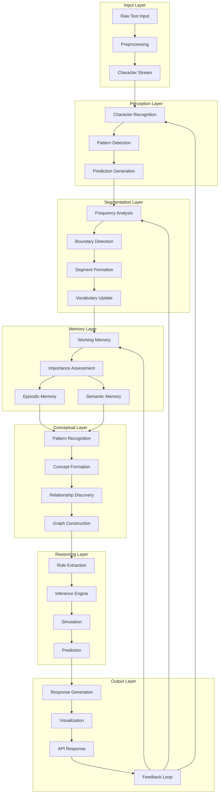

# Data Flow

Understanding how data flows through Brain AI's cognitive architecture is crucial for comprehending how the system transforms raw input into knowledge and actionable insights. This document details the complete data journey from input to output.

## Overview

Brain AI processes data through multiple interconnected stages, each adding layers of understanding and abstraction. The data flow is designed to mirror human cognitive processing, starting with basic perception and building up to complex reasoning.



## Data Types and Structures

### Core Data Types

Brain AI uses a unified data structure system that allows information to flow seamlessly between components:

```rust
// Primary data container for all system information
#[derive(Debug, Clone, Serialize, Deserialize)]
pub struct BrainData {
    pub content: DataContent,
    pub metadata: DataMetadata,
    pub confidence: f64,
    pub timestamp: SystemTime,
    pub source: ComponentId,
    pub processing_history: Vec<ProcessingStep>,
}

// Different types of content that can flow through the system
#[derive(Debug, Clone, Serialize, Deserialize)]
pub enum DataContent {
    // Raw input data
    RawText(String),
    Characters(Vec<char>),
    
    // Processed linguistic data
    Segments(Vec<TextSegment>),
    Predictions(Vec<CharacterPrediction>),
    
    // Memory data
    WorkingMemory(Vec<MemoryItem>),
    EpisodicMemory(Vec<Episode>),
    SemanticMemory(Vec<SemanticItem>),
    
    // Conceptual data
    Concepts(Vec<Concept>),
    Relationships(Vec<ConceptRelationship>),
    
    // Reasoning data
    Rules(Vec<InferenceRule>),
    Simulations(Vec<SimulationResult>),
    
    // Output data
    Response(String),
    Visualization(VisualizationData),
    Metrics(ComponentMetrics),
}

// Metadata that travels with data
#[derive(Debug, Clone, Serialize, Deserialize)]
pub struct DataMetadata {
    pub data_type: DataType,
    pub priority: Priority,
    pub tags: Vec<String>,
    pub relationships: Vec<DataRelationship>,
    pub quality_score: f64,
}
```

### Data Transformation Types

```rust
// Represents a transformation step in the processing pipeline
#[derive(Debug, Clone, Serialize, Deserialize)]
pub struct ProcessingStep {
    pub component: ComponentId,
    pub operation: String,
    pub input_hash: u64,
    pub output_hash: u64,
    pub duration: Duration,
    pub confidence_change: f64,
}

// Tracks relationships between data items
#[derive(Debug, Clone, Serialize, Deserialize)]
pub struct DataRelationship {
    pub relationship_type: RelationshipType,
    pub target_data_id: DataId,
    pub strength: f64,
    pub evidence: Vec<String>,
}
```

## Stage-by-Stage Data Flow

### Stage 1: Input Processing

Raw text input is preprocessed and converted into a character stream for cognitive processing.

**Input Transformation:**
```rust
// Raw text input processing
fn process_raw_input(input: &str) -> Result<BrainData> {
    let cleaned_text = preprocess_text(input)?;
    let character_stream = text_to_characters(&cleaned_text);
    
    Ok(BrainData {
        content: DataContent::Characters(character_stream),
        metadata: DataMetadata {
            data_type: DataType::RawInput,
            priority: Priority::Normal,
            tags: vec!["input".to_string()],
            relationships: vec![],
            quality_score: 1.0,
        },
        confidence: 1.0,
        timestamp: SystemTime::now(),
        source: ComponentId::InputProcessor,
        processing_history: vec![],
    })
}
```

**Data Characteristics:**
- **Volume**: Variable, typically 1-10KB per input
- **Velocity**: Real-time processing, <100ms latency
- **Variety**: Plain text, potentially multiple languages
- **Quality**: High, direct from source

### Stage 2: Character-Level Processing

Individual characters are processed to build predictive models and detect patterns.

**Character Prediction Flow:**
```rust
// Character ingestion processing
async fn process_characters(
    data: BrainData,
    predictor: &mut CharacterPredictor,
) -> Result<BrainData> {
    let characters = match data.content {
        DataContent::Characters(chars) => chars,
        _ => return Err(BrainError::InvalidDataType),
    };
    
    let mut predictions = Vec::new();
    let mut context_window = VecDeque::new();
    
    for (i, &current_char) in characters.iter().enumerate() {
        // Generate prediction for next character
        let prediction = predictor.predict_next(&context_window)?;
        predictions.push(CharacterPrediction {
            position: i,
            predicted_chars: prediction.candidates,
            confidence: prediction.confidence,
            actual_char: characters.get(i + 1).copied(),
        });
        
        // Update context window
        context_window.push_back(current_char);
        if context_window.len() > MAX_CONTEXT_SIZE {
            context_window.pop_front();
        }
        
        // Learn from actual character if available
        if let Some(actual) = characters.get(i + 1) {
            predictor.learn(current_char, *actual)?;
        }
    }
    
    Ok(BrainData {
        content: DataContent::Predictions(predictions),
        metadata: enrich_metadata(data.metadata, "character_prediction"),
        confidence: calculate_prediction_confidence(&predictions),
        timestamp: SystemTime::now(),
        source: ComponentId::CharacterIngestion,
        processing_history: append_processing_step(
            data.processing_history,
            "character_prediction",
            ComponentId::CharacterIngestion,
        ),
    })
}
```

**Data Transformations:**
- **Input**: Character stream (Vec<char>)
- **Output**: Character predictions with confidence scores
- **Enrichment**: Context windows, learning updates, pattern detection
- **Metrics**: Prediction accuracy, learning rate, processing speed

### Stage 3: Segmentation and Vocabulary Building

Character predictions are analyzed to discover meaningful segments and build vocabulary.

**Segmentation Flow:**
```rust
// Segment discovery processing
async fn discover_segments(
    data: BrainData,
    segmenter: &mut BpeSegmenter,
) -> Result<BrainData> {
    let predictions = match data.content {
        DataContent::Predictions(preds) => preds,
        _ => return Err(BrainError::InvalidDataType),
    };
    
    // Analyze prediction patterns for segment boundaries
    let text = reconstruct_text_from_predictions(&predictions);
    let segment_candidates = segmenter.find_segment_candidates(&text)?;
    
    let mut validated_segments = Vec::new();
    for candidate in segment_candidates {
        // Validate segment using prediction confidence
        let validation_score = validate_segment_with_predictions(
            &candidate, 
            &predictions
        )?;
        
        if validation_score > SEGMENT_VALIDATION_THRESHOLD {
            let segment = TextSegment {
                text: candidate.text,
                start_position: candidate.start,
                end_position: candidate.end,
                frequency: candidate.frequency,
                confidence: validation_score,
                context: extract_context(&text, &candidate),
            };
            
            validated_segments.push(segment);
            
            // Update vocabulary
            segmenter.add_to_vocabulary(&segment)?;
        }
    }
    
    Ok(BrainData {
        content: DataContent::Segments(validated_segments),
        metadata: enrich_metadata(data.metadata, "segmentation"),
        confidence: calculate_segmentation_confidence(&validated_segments),
        timestamp: SystemTime::now(),
        source: ComponentId::SegmentDiscovery,
        processing_history: append_processing_step(
            data.processing_history,
            "segment_discovery",
            ComponentId::SegmentDiscovery,
        ),
    })
}
```

**Data Characteristics:**
- **Segments**: Meaningful text units with boundaries
- **Vocabulary**: Dynamic, growing collection of discovered segments
- **Statistics**: Frequency counts, usage patterns, confidence scores
- **Context**: Surrounding text that helps validate segments

### Stage 4: Memory Processing

Segments are processed through the three-layer memory system for storage and retrieval.

**Memory Flow:**
```rust
// Memory system processing
async fn process_memory(
    data: BrainData,
    memory_system: &mut MemorySystem,
) -> Result<BrainData> {
    let segments = match data.content {
        DataContent::Segments(segs) => segs,
        _ => return Err(BrainError::InvalidDataType),
    };
    
    let mut memory_items = Vec::new();
    
    for segment in segments {
        // Assess importance for memory storage
        let importance = memory_system.assess_importance(&segment)?;
        
        // Store in working memory first
        let working_memory_item = MemoryItem {
            content: segment.text.clone(),
            item_type: MemoryType::Working,
            importance,
            timestamp: SystemTime::now(),
            access_count: 1,
            last_accessed: SystemTime::now(),
            associations: Vec::new(),
        };
        
        memory_system.store_working_memory(working_memory_item.clone())?;
        memory_items.push(working_memory_item);
        
        // Check for consolidation to long-term memory
        if importance > CONSOLIDATION_THRESHOLD {
            // Determine if episodic or semantic
            let memory_type = classify_memory_type(&segment)?;
            
            match memory_type {
                MemoryType::Episodic => {
                    let episode = Episode {
                        content: segment.text.clone(),
                        context: segment.context.clone(),
                        timestamp: SystemTime::now(),
                        importance,
                        related_episodes: Vec::new(),
                    };
                    memory_system.store_episodic_memory(episode)?;
                }
                MemoryType::Semantic => {
                    let semantic_item = SemanticItem {
                        content: segment.text.clone(),
                        abstraction_level: calculate_abstraction_level(&segment),
                        embedding: generate_embedding(&segment.text)?,
                        related_concepts: Vec::new(),
                    };
                    memory_system.store_semantic_memory(semantic_item)?;
                }
                _ => {} // Already handled working memory
            }
        }
    }
    
    Ok(BrainData {
        content: DataContent::WorkingMemory(memory_items),
        metadata: enrich_metadata(data.metadata, "memory_processing"),
        confidence: calculate_memory_confidence(&memory_items),
        timestamp: SystemTime::now(),
        source: ComponentId::MemorySystem,
        processing_history: append_processing_step(
            data.processing_history,
            "memory_processing",
            ComponentId::MemorySystem,
        ),
    })
}
```

**Memory Data Flow:**
- **Working Memory**: Temporary storage with priority-based eviction
- **Episodic Memory**: Specific events with temporal and contextual information
- **Semantic Memory**: Abstract knowledge with embeddings and relationships
- **Consolidation**: Movement from working to long-term memory based on importance

### Stage 5: Concept Formation

Memory patterns are analyzed to form abstract concepts and relationships.

**Concept Formation Flow:**
```rust
// Concept graph processing
async fn form_concepts(
    data: BrainData,
    concept_graph: &mut ConceptGraph,
) -> Result<BrainData> {
    let memory_items = match data.content {
        DataContent::WorkingMemory(items) => items,
        _ => return Err(BrainError::InvalidDataType),
    };
    
    // Analyze patterns across memory items
    let patterns = identify_patterns_in_memory(&memory_items)?;
    
    let mut concepts = Vec::new();
    let mut relationships = Vec::new();
    
    for pattern in patterns {
        // Check if pattern represents a new concept
        if pattern.strength > CONCEPT_FORMATION_THRESHOLD {
            let concept = Concept {
                id: generate_concept_id(),
                name: pattern.representative_text,
                concept_type: classify_concept_type(&pattern),
                activation: pattern.strength,
                properties: extract_properties(&pattern),
                instances: pattern.supporting_items,
                created_at: SystemTime::now(),
                last_activated: SystemTime::now(),
            };
            
            concept_graph.add_concept(concept.clone())?;
            concepts.push(concept);
        }
        
        // Discover relationships between concepts
        let pattern_relationships = discover_relationships(&pattern, &concepts)?;
        for relationship in pattern_relationships {
            concept_graph.add_relationship(relationship.clone())?;
            relationships.push(relationship);
        }
    }
    
    // Apply Hebbian learning to strengthen relationships
    for relationship in &relationships {
        concept_graph.strengthen_relationship(
            relationship.source,
            relationship.target,
            HEBBIAN_LEARNING_RATE,
        )?;
    }
    
    Ok(BrainData {
        content: DataContent::Concepts(concepts),
        metadata: enrich_metadata(data.metadata, "concept_formation"),
        confidence: calculate_concept_confidence(&concepts),
        timestamp: SystemTime::now(),
        source: ComponentId::ConceptGraph,
        processing_history: append_processing_step(
            data.processing_history,
            "concept_formation",
            ComponentId::ConceptGraph,
        ),
    })
}
```

**Concept Data Flow:**
- **Pattern Recognition**: Identification of recurring themes in memory
- **Concept Creation**: Formation of abstract concept nodes
- **Relationship Discovery**: Connection of concepts through various relationship types
- **Hebbian Learning**: Strengthening of frequently co-activated relationships

### Stage 6: Reasoning and Simulation

Concepts and relationships are used for rule extraction and scenario simulation.

**Reasoning Flow:**
```rust
// Simulation engine processing
async fn process_reasoning(
    data: BrainData,
    simulation_engine: &mut SimulationEngine,
) -> Result<BrainData> {
    let concepts = match data.content {
        DataContent::Concepts(concepts) => concepts,
        _ => return Err(BrainError::InvalidDataType),
    };
    
    // Extract rules from concept relationships
    let rules = extract_inference_rules(&concepts)?;
    
    // Run simulations using extracted rules
    let mut simulation_results = Vec::new();
    
    for scenario in generate_scenarios(&concepts)? {
        let simulation_result = simulation_engine.simulate(
            scenario,
            &rules,
            MAX_SIMULATION_STEPS,
        )?;
        
        simulation_results.push(simulation_result);
    }
    
    // Validate rules based on simulation outcomes
    let validated_rules = validate_rules_with_simulations(&rules, &simulation_results)?;
    
    Ok(BrainData {
        content: DataContent::Simulations(simulation_results),
        metadata: enrich_metadata(data.metadata, "reasoning"),
        confidence: calculate_reasoning_confidence(&simulation_results),
        timestamp: SystemTime::now(),
        source: ComponentId::SimulationEngine,
        processing_history: append_processing_step(
            data.processing_history,
            "reasoning",
            ComponentId::SimulationEngine,
        ),
    })
}
```

**Reasoning Data Flow:**
- **Rule Extraction**: Derivation of inference rules from concept relationships
- **Scenario Generation**: Creation of hypothetical situations for testing
- **Simulation Execution**: Running scenarios through extracted rules
- **Validation**: Confirming rule accuracy through simulation outcomes

## Data Flow Optimization

### Parallel Processing

Brain AI optimizes data flow through parallel processing where possible:

```rust
// Parallel processing pipeline
async fn parallel_processing_pipeline(
    input_data: BrainData,
    components: &mut ComponentRegistry,
) -> Result<BrainData> {
    // Split data for parallel processing
    let data_chunks = split_data_for_parallel_processing(input_data)?;
    
    // Process chunks in parallel
    let futures: Vec<_> = data_chunks
        .into_iter()
        .map(|chunk| {
            let component = components.get_component_for_data(&chunk)?;
            component.process_async(chunk)
        })
        .collect();
    
    // Wait for all processing to complete
    let results = futures::future::try_join_all(futures).await?;
    
    // Merge results back together
    let merged_result = merge_parallel_results(results)?;
    
    Ok(merged_result)
}
```

### Caching and Memoization

Frequently accessed data is cached to improve performance:

```rust
// Caching layer for data flow optimization
pub struct DataFlowCache {
    l1_cache: LruCache<DataHash, BrainData>,
    l2_cache: Arc<Mutex<HashMap<DataHash, BrainData>>>,
    persistent_cache: Arc<DiskCache>,
}

impl DataFlowCache {
    pub async fn get_or_process<F, Fut>(
        &mut self,
        data_hash: DataHash,
        processor: F,
    ) -> Result<BrainData>
    where
        F: FnOnce() -> Fut,
        Fut: Future<Output = Result<BrainData>>,
    {
        // Check L1 cache
        if let Some(cached_data) = self.l1_cache.get(&data_hash) {
            return Ok(cached_data.clone());
        }
        
        // Check L2 cache
        if let Some(cached_data) = self.l2_cache.lock().await.get(&data_hash) {
            self.l1_cache.put(data_hash, cached_data.clone());
            return Ok(cached_data.clone());
        }
        
        // Check persistent cache
        if let Some(cached_data) = self.persistent_cache.get(&data_hash).await? {
            self.l1_cache.put(data_hash, cached_data.clone());
            self.l2_cache.lock().await.insert(data_hash, cached_data.clone());
            return Ok(cached_data);
        }
        
        // Process and cache
        let result = processor().await?;
        self.cache_at_all_levels(data_hash, result.clone()).await?;
        Ok(result)
    }
}
```

### Data Compression

Large data structures are compressed for efficient storage and transmission:

```rust
// Data compression for efficient flow
pub struct DataCompressor {
    compression_algorithm: CompressionAlgorithm,
    compression_threshold: usize,
}

impl DataCompressor {
    pub fn compress_if_beneficial(&self, data: &BrainData) -> Result<BrainData> {
        let serialized_size = self.estimate_serialized_size(data)?;
        
        if serialized_size > self.compression_threshold {
            let compressed_content = self.compress_content(&data.content)?;
            
            Ok(BrainData {
                content: DataContent::Compressed {
                    algorithm: self.compression_algorithm,
                    data: compressed_content,
                    original_size: serialized_size,
                },
                metadata: data.metadata.clone(),
                confidence: data.confidence,
                timestamp: data.timestamp,
                source: data.source,
                processing_history: data.processing_history.clone(),
            })
        } else {
            Ok(data.clone())
        }
    }
}
```

## Data Flow Monitoring

### Flow Metrics

Data flow is continuously monitored for performance and quality:

```rust
// Data flow metrics collection
#[derive(Debug, Clone)]
pub struct DataFlowMetrics {
    pub throughput: f64,           // Items per second
    pub latency: Duration,         // Average processing time
    pub error_rate: f64,           // Percentage of failed operations
    pub data_quality: f64,         // Average confidence score
    pub cache_hit_rate: f64,       // Percentage of cache hits
    pub compression_ratio: f64,    // Average compression achieved
}

impl DataFlowMetrics {
    pub fn collect_metrics(
        &mut self,
        processing_results: &[ProcessingResult],
    ) -> Result<()> {
        let total_items = processing_results.len() as f64;
        let successful_items = processing_results
            .iter()
            .filter(|r| r.is_success())
            .count() as f64;
        
        self.throughput = total_items / self.calculate_time_window().as_secs_f64();
        self.latency = self.calculate_average_latency(processing_results);
        self.error_rate = (total_items - successful_items) / total_items;
        self.data_quality = self.calculate_average_confidence(processing_results);
        
        Ok(())
    }
}
```

### Flow Visualization

Data flow can be visualized for debugging and optimization:

```rust
// Data flow visualization
pub struct DataFlowVisualizer {
    flow_graph: petgraph::Graph<ComponentId, DataFlowEdge>,
    metrics_history: VecDeque<DataFlowMetrics>,
}

impl DataFlowVisualizer {
    pub fn generate_flow_diagram(&self) -> Result<String> {
        let mut mermaid_diagram = String::from("graph TD\n");
        
        // Add nodes
        for node_index in self.flow_graph.node_indices() {
            let component_id = &self.flow_graph[node_index];
            mermaid_diagram.push_str(&format!(
                "    {}[{}]\n",
                component_id.as_str(),
                component_id.display_name()
            ));
        }
        
        // Add edges
        for edge_index in self.flow_graph.edge_indices() {
            let (source, target) = self.flow_graph.edge_endpoints(edge_index).unwrap();
            let edge_data = &self.flow_graph[edge_index];
            
            mermaid_diagram.push_str(&format!(
                "    {} -->|{}| {}\n",
                self.flow_graph[source].as_str(),
                edge_data.data_type,
                self.flow_graph[target].as_str()
            ));
        }
        
        Ok(mermaid_diagram)
    }
}
```

## Error Handling in Data Flow

### Data Validation

All data is validated at each stage to ensure quality and consistency:

```rust
// Data validation pipeline
pub struct DataValidator {
    validation_rules: Vec<Box<dyn ValidationRule>>,
    quality_thresholds: QualityThresholds,
}

impl DataValidator {
    pub fn validate_data(&self, data: &BrainData) -> ValidationResult {
        let mut validation_errors = Vec::new();
        
        // Apply validation rules
        for rule in &self.validation_rules {
            if let Err(error) = rule.validate(data) {
                validation_errors.push(error);
            }
        }
        
        // Check quality thresholds
        if data.confidence < self.quality_thresholds.min_confidence {
            validation_errors.push(ValidationError::LowConfidence {
                actual: data.confidence,
                required: self.quality_thresholds.min_confidence,
            });
        }
        
        if validation_errors.is_empty() {
            ValidationResult::Valid
        } else {
            ValidationResult::Invalid(validation_errors)
        }
    }
}
```

### Error Recovery

Data flow includes robust error recovery mechanisms:

```rust
// Error recovery in data flow
pub struct DataFlowErrorRecovery {
    retry_strategies: HashMap<BrainError, RetryStrategy>,
    fallback_processors: HashMap<ComponentId, Box<dyn FallbackProcessor>>,
}

impl DataFlowErrorRecovery {
    pub async fn recover_from_error(
        &self,
        error: BrainError,
        failed_data: BrainData,
        component: ComponentId,
    ) -> Result<BrainData> {
        // Try retry strategy first
        if let Some(retry_strategy) = self.retry_strategies.get(&error) {
            match retry_strategy.attempt_retry(&failed_data, component).await {
                Ok(recovered_data) => return Ok(recovered_data),
                Err(_) => {
                    // Retry failed, try fallback
                }
            }
        }
        
        // Use fallback processor
        if let Some(fallback) = self.fallback_processors.get(&component) {
            let fallback_result = fallback.process_with_degraded_quality(&failed_data)?;
            return Ok(fallback_result);
        }
        
        // If all recovery attempts fail, return error
        Err(BrainError::UnrecoverableDataFlowError {
            original_error: Box::new(error),
            component,
            data_hash: calculate_data_hash(&failed_data),
        })
    }
}
```

## Data Flow Security

### Data Sanitization

All input data is sanitized to prevent injection attacks and ensure safety:

```rust
// Data sanitization pipeline
pub struct DataSanitizer {
    sanitization_rules: Vec<Box<dyn SanitizationRule>>,
    allowed_data_types: HashSet<DataType>,
}

impl DataSanitizer {
    pub fn sanitize_data(&self, data: &mut BrainData) -> Result<()> {
        // Check if data type is allowed
        if !self.allowed_data_types.contains(&data.metadata.data_type) {
            return Err(BrainError::DisallowedDataType {
                data_type: data.metadata.data_type.clone(),
            });
        }
        
        // Apply sanitization rules
        for rule in &self.sanitization_rules {
            rule.sanitize(data)?;
        }
        
        // Update metadata to reflect sanitization
        data.metadata.tags.push("sanitized".to_string());
        data.processing_history.push(ProcessingStep {
            component: ComponentId::DataSanitizer,
            operation: "sanitization".to_string(),
            input_hash: calculate_data_hash(data),
            output_hash: calculate_data_hash(data), // Will be different after sanitization
            duration: Duration::from_millis(1), // Sanitization is fast
            confidence_change: 0.0, // Sanitization doesn't change confidence
        });
        
        Ok(())
    }
}
```

This comprehensive data flow architecture ensures that information moves efficiently and securely through Brain AI's cognitive pipeline, transforming raw input into sophisticated understanding and actionable insights. The system's design allows for parallel processing, caching optimization, quality assurance, and robust error handling while maintaining the integrity and security of all data transformations.
