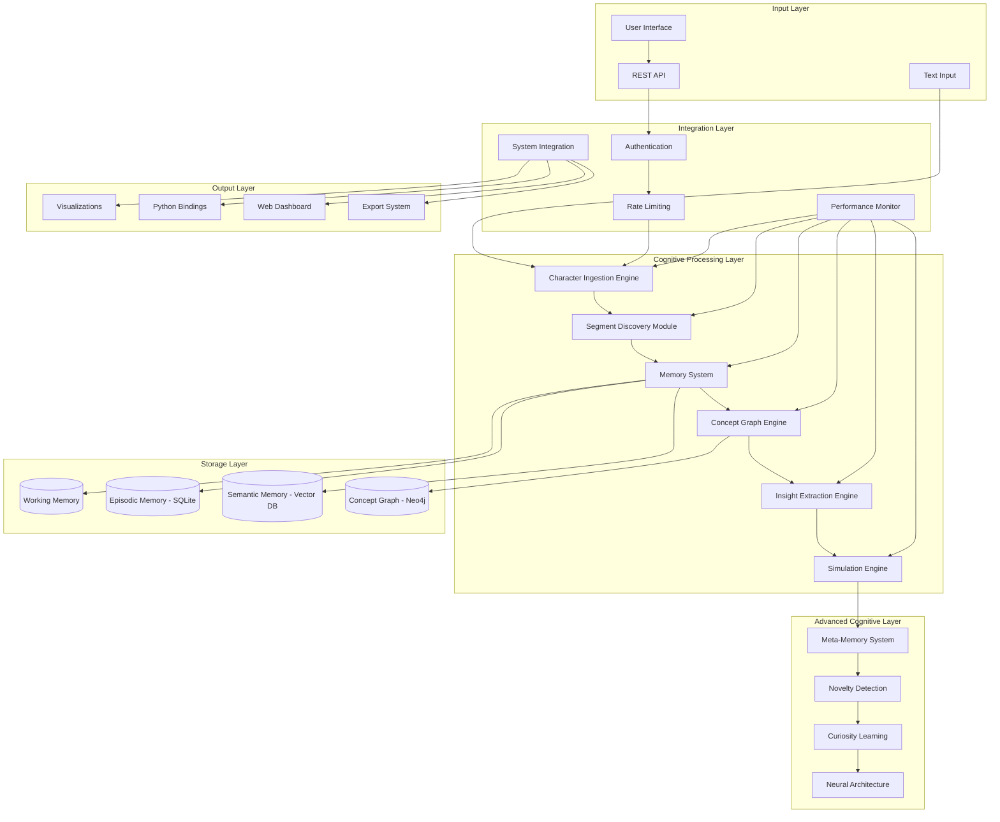

# System Architecture

Brain AI implements a sophisticated post-transformer developmental AI architecture that mimics human-like cognitive development. This document provides a comprehensive overview of the system's design, components, and architectural decisions.

## High-Level Architecture

## Core Architectural Principles

### 1. Developmental Learning
Brain AI follows a developmental approach where understanding emerges gradually:
- **Character-level foundation**: Starts with basic character prediction
- **Pattern emergence**: Discovers segments and patterns without pre-training
- **Concept formation**: Builds abstract concepts from concrete patterns
- **Rule extraction**: Formulates general rules from specific observations
- **Meta-cognitive awareness**: Develops understanding of its own knowledge

### 2. Multi-Layer Memory Architecture
The memory system mirrors human cognitive architecture:
- **Working Memory**: Active information processing and temporary storage
- **Episodic Memory**: Specific events and experiences with temporal context
- **Semantic Memory**: General knowledge and abstract concepts
- **Meta-Memory**: Knowledge about knowledge - what the system knows and doesn't know

### 3. Unified Component Interface
All components implement standardized interfaces for:
- **Configuration**: Consistent setup and parameter management
- **Operations**: Standard method signatures for core functionality
- **Metrics**: Uniform performance monitoring and reporting
- **Error Handling**: Consistent error propagation and recovery

## Component Architecture

### Character Ingestion Engine

The foundation of Brain AI's learning process starts with character-level understanding:

**Key Features:**
- GRU-based neural architecture with self-attention
- Dynamic vocabulary building from character sequences
- Confidence scoring for predictions
- Incremental learning from new text

### Memory System

The three-layer memory architecture provides different types of storage and retrieval:

**Key Features:**
- Three-layer memory architecture with different retention policies
- Priority-based working memory with LRU eviction
- Temporal episodic memory with event relationships
- Vector-based semantic memory for concept storage
- Automatic consolidation from working to long-term memory

### Concept Graph Engine

Neo4j-based knowledge representation with relationship learning:

**Key Features:**
- Neo4j-based graph database for concept relationships
- Hebbian learning for connection strengthening
- Automatic concept discovery and relationship formation
- Graph traversal algorithms for concept exploration
- Connection decay to forget unused relationships

### Simulation Engine

Advanced scenario modeling with branching possibilities:

**Key Features:**
- Multi-path scenario exploration with branching
- Intelligent pruning to prevent exponential explosion
- Confidence scoring with decay over simulation depth
- Constraint-based exploration with rule validation
- Real-time analytics and effectiveness assessment

## Performance Architecture

### Monitoring System

Real-time performance tracking and optimization:

**Key Features:**
- Real-time system resource monitoring
- Component-level performance tracking
- Bottleneck identification and resolution
- Automatic optimization recommendations
- Alert management for performance thresholds

## Security Architecture

### Authentication & Authorization

Comprehensive security with role-based access control:

**Security Features:**
- JWT-based authentication with configurable expiration
- Role-based access control for different user types
- Rate limiting to prevent abuse and DoS attacks
- Input sanitization and validation
- Comprehensive audit logging
- Data encryption at rest and in transit

## Deployment Architecture

### Container Architecture

Production-ready containerized deployment:

**Deployment Features:**
- Multi-stage Docker builds for optimized images
- Service orchestration with Docker Compose
- Persistent volumes for data and configuration
- Network isolation for security
- Health checks and automatic restart policies
- Resource limits and monitoring

---

This architecture provides a robust foundation for Brain AI's cognitive capabilities while maintaining scalability, security, and maintainability. Each component is designed to work independently while contributing to the overall cognitive system's emergent intelligence. 