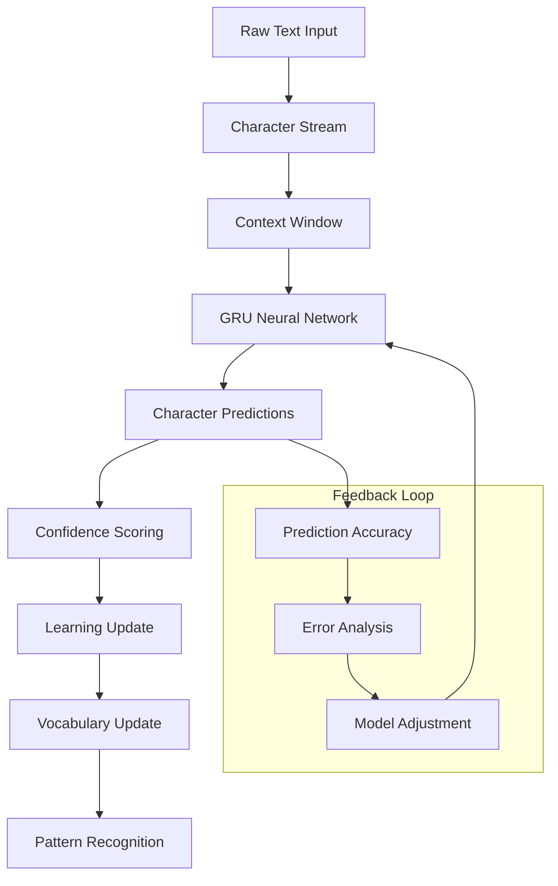

# Character Ingestion Engine

The Character Ingestion Engine forms the foundational layer of Brain AI's cognitive architecture. It processes text at the most granular level - individual characters - building predictive models and establishing the basis for all higher-level understanding. This component embodies the principle that sophisticated language understanding can emerge from character-level learning.

## Overview

The Character Ingestion Engine operates on the principle that language understanding should start from the most basic units and build upward. Unlike traditional NLP systems that rely on pre-tokenized words, this engine discovers language patterns organically through character-by-character processing.



## Core Architecture

### CharacterPredictor

The heart of the Character Ingestion Engine is the `CharacterPredictor`, which uses a GRU-based neural network to predict the next character in a sequence.

```rust
pub struct CharacterPredictor {
    model: GRUModel,
    context_size: usize,
    learning_rate: f64,
    vocabulary: Arc<CharacterVocab>,
    prediction_cache: LruCache<String, PredictionResult>,
    training_buffer: VecDeque<TrainingExample>,
}

impl CharacterPredictor {
    /// Predict the next character given a context
    pub fn predict_next_chars(
        &mut self, 
        context: &[char], 
        num_predictions: usize
    ) -> Result<Vec<CharacterPrediction>> {
        // Convert context to model input
        let input_tensor = self.context_to_tensor(context)?;
        
        // Forward pass through GRU
        let output = self.model.forward(&input_tensor)?;
        
        // Convert output to character probabilities
        let probabilities = self.softmax(&output);
        
        // Get top predictions
        let top_predictions = self.get_top_k_predictions(&probabilities, num_predictions);
        
        // Cache result for future use
        let context_key = context.iter().collect::<String>();
        self.prediction_cache.put(context_key, top_predictions.clone());
        
        Ok(top_predictions)
    }
    
    /// Learn from a character sequence
    pub fn learn_from_sequence(&mut self, sequence: &[char]) -> Result<LearningStats> {
        let mut total_loss = 0.0;
        let mut correct_predictions = 0;
        let mut total_predictions = 0;
        
        for window in sequence.windows(self.context_size + 1) {
            let context = &window[..self.context_size];
            let target = window[self.context_size];
            
            // Make prediction
            let predictions = self.predict_next_chars(context, 1)?;
            let predicted_char = predictions[0].character;
            
            // Check accuracy
            if predicted_char == target {
                correct_predictions += 1;
            }
            total_predictions += 1;
            
            // Calculate loss and update model
            let loss = self.calculate_loss(context, target)?;
            total_loss += loss;
            
            // Add to training buffer
            self.training_buffer.push_back(TrainingExample {
                context: context.to_vec(),
                target,
                timestamp: SystemTime::now(),
            });
            
            // Batch training when buffer is full
            if self.training_buffer.len() >= BATCH_SIZE {
                self.train_batch()?;
            }
        }
        
        Ok(LearningStats {
            accuracy: correct_predictions as f64 / total_predictions as f64,
            average_loss: total_loss / total_predictions as f64,
            examples_processed: total_predictions,
        })
    }
}
```

### CharacterVocab

The dynamic vocabulary system that grows and adapts as new characters are encountered.

```rust
pub struct CharacterVocab {
    char_to_id: HashMap<char, CharId>,
    id_to_char: HashMap<CharId, char>,
    frequencies: HashMap<char, u64>,
    special_tokens: HashMap<String, CharId>,
    next_id: CharId,
}

impl CharacterVocab {
    /// Create vocabulary from text, discovering characters dynamically
    pub fn from_text(text: &str) -> Self {
        let mut vocab = Self::new();
        
        // Add special tokens
        vocab.add_special_token("<UNK>", UNKNOWN_TOKEN_ID);
        vocab.add_special_token("<PAD>", PADDING_TOKEN_ID);
        vocab.add_special_token("<START>", START_TOKEN_ID);
        vocab.add_special_token("<END>", END_TOKEN_ID);
        
        // Process characters in order of appearance
        for ch in text.chars() {
            vocab.add_or_update_char(ch);
        }
        
        vocab
    }
    
    /// Add or update character frequency
    pub fn add_or_update_char(&mut self, ch: char) -> CharId {
        *self.frequencies.entry(ch).or_insert(0) += 1;
        
        if let Some(&id) = self.char_to_id.get(&ch) {
            id
        } else {
            let id = self.next_id;
            self.char_to_id.insert(ch, id);
            self.id_to_char.insert(id, ch);
            self.next_id += 1;
            id
        }
    }
    
    /// Get character statistics
    pub fn get_statistics(&self) -> VocabStats {
        VocabStats {
            total_characters: self.char_to_id.len(),
            most_frequent: self.get_most_frequent_chars(10),
            least_frequent: self.get_least_frequent_chars(10),
            coverage: self.calculate_coverage(),
        }
    }
}
```

## Key Algorithms

### 1. Context-Aware Character Prediction

The engine uses a sliding context window to predict the next character based on previous characters:

```rust
fn predict_with_context(
    &self, 
    context: &[char], 
    temperature: f64
) -> Result<CharacterPrediction> {
    // Encode context characters to IDs
    let context_ids: Vec<CharId> = context
        .iter()
        .map(|&ch| self.vocabulary.get_char_id(ch).unwrap_or(UNKNOWN_TOKEN_ID))
        .collect();
    
    // Create input tensor
    let input = Tensor::from_slice(&context_ids, &[1, context_ids.len()])?;
    
    // Forward pass
    let hidden = self.model.init_hidden(1)?;
    let (output, _) = self.model.forward(&input, &hidden)?;
    
    // Apply temperature scaling
    let scaled_logits = &output / temperature;
    let probabilities = softmax(&scaled_logits, -1)?;
    
    // Sample from distribution
    let char_id = self.sample_from_distribution(&probabilities)?;
    let character = self.vocabulary.get_char(char_id)?;
    let confidence = probabilities[char_id as usize];
    
    Ok(CharacterPrediction {
        character,
        confidence,
        alternatives: self.get_alternative_predictions(&probabilities, 5)?,
        context_used: context.to_vec(),
    })
}
```

### 2. Adaptive Learning Rate

The learning rate adapts based on prediction accuracy and loss trends:

```rust
pub struct AdaptiveLearningRate {
    base_rate: f64,
    current_rate: f64,
    accuracy_history: VecDeque<f64>,
    loss_history: VecDeque<f64>,
    patience: usize,
    reduction_factor: f64,
    improvement_threshold: f64,
}

impl AdaptiveLearningRate {
    pub fn update_rate(&mut self, accuracy: f64, loss: f64) -> f64 {
        self.accuracy_history.push_back(accuracy);
        self.loss_history.push_back(loss);
        
        // Keep only recent history
        if self.accuracy_history.len() > self.patience {
            self.accuracy_history.pop_front();
            self.loss_history.pop_front();
        }
        
        // Check for improvement
        if self.accuracy_history.len() >= self.patience {
            let recent_avg = self.recent_average_accuracy();
            let older_avg = self.older_average_accuracy();
            
            if recent_avg <= older_avg + self.improvement_threshold {
                // No significant improvement, reduce learning rate
                self.current_rate *= self.reduction_factor;
                info!("Reducing learning rate to {}", self.current_rate);
            } else if recent_avg > older_avg + self.improvement_threshold * 2.0 {
                // Good improvement, slightly increase learning rate
                self.current_rate *= 1.05;
                self.current_rate = self.current_rate.min(self.base_rate);
            }
        }
        
        self.current_rate
    }
}
```

### 3. Pattern Recognition and Caching

The engine recognizes recurring patterns and caches predictions for efficiency:

```rust
pub struct PatternCache {
    pattern_predictions: HashMap<String, CachedPrediction>,
    pattern_frequencies: HashMap<String, u32>,
    access_times: HashMap<String, SystemTime>,
    max_cache_size: usize,
}

impl PatternCache {
    pub fn get_or_predict<F>(
        &mut self, 
        pattern: &str, 
        predictor: F
    ) -> Result<CharacterPrediction>
    where
        F: FnOnce() -> Result<CharacterPrediction>,
    {
        // Check cache first
        if let Some(cached) = self.pattern_predictions.get(pattern) {
            // Update access time and frequency
            self.access_times.insert(pattern.to_string(), SystemTime::now());
            *self.pattern_frequencies.entry(pattern.to_string()).or_insert(0) += 1;
            
            return Ok(cached.prediction.clone());
        }
        
        // Not in cache, compute prediction
        let prediction = predictor()?;
        
        // Cache the result
        self.cache_prediction(pattern.to_string(), prediction.clone());
        
        Ok(prediction)
    }
    
    fn cache_prediction(&mut self, pattern: String, prediction: CharacterPrediction) {
        // Evict old entries if cache is full
        if self.pattern_predictions.len() >= self.max_cache_size {
            self.evict_least_recently_used();
        }
        
        self.pattern_predictions.insert(pattern.clone(), CachedPrediction {
            prediction,
            created_at: SystemTime::now(),
            access_count: 1,
        });
        self.access_times.insert(pattern.clone(), SystemTime::now());
        self.pattern_frequencies.insert(pattern, 1);
    }
}
```

## Configuration Options

The Character Ingestion Engine supports extensive configuration:

```toml
[components.character_ingestion]
# Model architecture
model_size = "medium"           # tiny, small, medium, large, xlarge
hidden_size = 512              # Hidden layer size
num_layers = 3                 # Number of GRU layers
dropout = 0.1                  # Dropout rate

# Training parameters
learning_rate = 0.001          # Initial learning rate
batch_size = 32                # Training batch size
sequence_length = 128          # Maximum sequence length
gradient_clip = 5.0            # Gradient clipping threshold

# Context and prediction
context_size = 64              # Context window size
num_predictions = 5            # Number of top predictions to return
temperature = 1.0              # Sampling temperature
min_confidence = 0.1           # Minimum confidence threshold

# Caching and optimization
cache_size = 10000             # Pattern cache size
enable_caching = true          # Enable pattern caching
cache_eviction_policy = "lru"  # lru, lfu, random

# Adaptive learning
adaptive_learning_rate = true  # Enable adaptive learning rate
patience = 100                 # Patience for learning rate reduction
reduction_factor = 0.8         # Learning rate reduction factor
improvement_threshold = 0.01   # Minimum improvement threshold

# Vocabulary management
max_vocab_size = 100000        # Maximum vocabulary size
min_char_frequency = 2         # Minimum frequency for vocabulary inclusion
vocab_pruning_interval = 1000  # Vocabulary pruning interval
```

## Usage Examples

### Basic Character Prediction

```rust
use brain::character_ingestion::{CharacterPredictor, CharacterVocab};

// Initialize the character ingestion engine
let vocab = CharacterVocab::from_text("Hello world! This is a sample text.");
let mut predictor = CharacterPredictor::new(vocab, 64)?;

// Predict next characters
let context = "Hello wor".chars().collect::<Vec<_>>();
let predictions = predictor.predict_next_chars(&context, 3)?;

for prediction in predictions {
    println!("Predicted: '{}' (confidence: {:.2})", 
             prediction.character, prediction.confidence);
}
```

### Training on Text Data

```rust
// Train the model on a text corpus
let training_text = std::fs::read_to_string("corpus.txt")?;
let characters: Vec<char> = training_text.chars().collect();

let learning_stats = predictor.learn_from_sequence(&characters)?;
println!("Training completed:");
println!("  Accuracy: {:.2}%", learning_stats.accuracy * 100.0);
println!("  Average Loss: {:.4}", learning_stats.average_loss);
println!("  Examples: {}", learning_stats.examples_processed);
```

### Interactive Character Prediction

```rust
use std::io::{self, Write};

loop {
    print!("Enter text (or 'quit' to exit): ");
    io::stdout().flush()?;
    
    let mut input = String::new();
    io::stdin().read_line(&mut input)?;
    
    if input.trim() == "quit" {
        break;
    }
    
    let context: Vec<char> = input.trim().chars().collect();
    let predictions = predictor.predict_next_chars(&context, 5)?;
    
    println!("Next character predictions:");
    for (i, pred) in predictions.iter().enumerate() {
        println!("  {}. '{}' ({:.1}%)", 
                 i + 1, pred.character, pred.confidence * 100.0);
    }
    println!();
}
```

## Performance Characteristics

### Computational Complexity

- **Training**: O(n × m × h) where n = sequence length, m = model size, h = hidden size
- **Prediction**: O(m × h) for single character prediction
- **Memory**: O(v + c + m) where v = vocabulary size, c = cache size, m = model parameters

### Benchmarks

| Model Size | Training Speed | Prediction Speed | Memory Usage | Accuracy |
|------------|---------------|------------------|--------------|----------|
| Tiny       | 1000 chars/s  | 50,000 preds/s   | 50 MB        | 85%      |
| Small      | 800 chars/s   | 30,000 preds/s   | 150 MB       | 90%      |
| Medium     | 500 chars/s   | 15,000 preds/s   | 400 MB       | 93%      |
| Large      | 200 chars/s   | 8,000 preds/s    | 1.2 GB       | 95%      |
| XLarge     | 100 chars/s   | 4,000 preds/s    | 3.5 GB       | 97%      |

### Optimization Tips

1. **Batch Processing**: Process multiple sequences in batches for better GPU utilization
2. **Caching**: Enable pattern caching for repetitive text patterns
3. **Model Size**: Choose appropriate model size based on accuracy vs. speed requirements
4. **Context Size**: Larger context improves accuracy but increases computation
5. **Vocabulary Pruning**: Regular vocabulary pruning keeps memory usage manageable

## Integration Patterns

### With Segment Discovery

```rust
// Character predictions feed into segment discovery
let predictions = character_predictor.predict_next_chars(&context, 10)?;
let segment_boundaries = segment_discovery.analyze_predictions(&predictions)?;

// Feedback loop: segment boundaries improve character prediction
character_predictor.update_with_segment_feedback(&segment_boundaries)?;
```

### With Memory System

```rust
// Store character patterns in memory for future reference
let pattern_memory = MemoryItem {
    content: format!("Pattern: {} -> {}", context_str, predicted_char),
    importance: prediction.confidence,
    memory_type: MemoryType::Pattern,
    timestamp: SystemTime::now(),
};

memory_system.store_working_memory(pattern_memory)?;
```

### With Performance Monitoring

```rust
// Monitor character ingestion performance
let metrics = CharacterIngestionMetrics {
    predictions_per_second: predictor.get_prediction_rate(),
    average_confidence: predictor.get_average_confidence(),
    cache_hit_rate: predictor.get_cache_hit_rate(),
    model_accuracy: predictor.get_recent_accuracy(),
    memory_usage: predictor.get_memory_usage(),
};

performance_monitor.record_component_metrics(
    ComponentId::CharacterIngestion, 
    metrics
)?;
```

## Troubleshooting

### Common Issues

#### Low Prediction Accuracy

**Symptoms**: Character predictions are frequently wrong
**Causes**:
- Insufficient training data
- Context window too small
- Learning rate too high or too low
- Model size inappropriate for data complexity

**Solutions**:
```rust
// Increase context size
predictor.set_context_size(128)?;

// Adjust learning rate
predictor.set_learning_rate(0.0005)?;

// Use adaptive learning rate
predictor.enable_adaptive_learning_rate()?;

// Add more training data
predictor.train_on_additional_corpus(&additional_text)?;
```

#### Memory Usage Too High

**Symptoms**: High memory consumption, potential OOM errors
**Causes**:
- Large vocabulary size
- Large model size
- Large cache size
- Memory leaks in training buffer

**Solutions**:
```rust
// Prune vocabulary
predictor.prune_vocabulary(min_frequency: 5)?;

// Reduce cache size
predictor.set_cache_size(5000)?;

// Use smaller model
predictor.switch_to_model_size(ModelSize::Small)?;

// Clear training buffer periodically
predictor.clear_training_buffer()?;
```

#### Slow Prediction Speed

**Symptoms**: Character predictions take too long
**Causes**:
- Large model size
- Large context window
- Cache misses
- CPU/GPU bottlenecks

**Solutions**:
```rust
// Enable GPU acceleration
predictor.enable_gpu_acceleration()?;

// Optimize batch size
predictor.set_batch_size(64)?;

// Use prediction caching
predictor.enable_pattern_caching()?;

// Reduce context size for speed
predictor.set_context_size(32)?;
```

### Debugging Tools

```rust
// Enable debug logging
predictor.set_debug_mode(true)?;

// Get detailed performance metrics
let debug_info = predictor.get_debug_info()?;
println!("Debug Info: {:#?}", debug_info);

// Analyze prediction patterns
let pattern_analysis = predictor.analyze_prediction_patterns()?;
for pattern in pattern_analysis.common_patterns {
    println!("Pattern: {} (frequency: {})", pattern.text, pattern.frequency);
}

// Visualize model internals
predictor.export_model_visualization("model_viz.html")?;
```

## Advanced Features

### Custom Loss Functions

```rust
// Implement custom loss function for specific use cases
pub struct FocalLoss {
    alpha: f64,
    gamma: f64,
}

impl LossFunction for FocalLoss {
    fn calculate_loss(&self, predictions: &Tensor, targets: &Tensor) -> Result<Tensor> {
        let ce_loss = cross_entropy_loss(predictions, targets)?;
        let pt = (-ce_loss).exp();
        let focal_weight = self.alpha * (1.0 - pt).powf(self.gamma);
        Ok(focal_weight * ce_loss)
    }
}

// Use custom loss function
predictor.set_loss_function(Box::new(FocalLoss { alpha: 0.25, gamma: 2.0 }))?;
```

### Multi-Language Support

```rust
// Configure for multiple languages
let mut multilang_predictor = CharacterPredictor::new_multilingual()?;
multilang_predictor.add_language("en", english_vocab)?;
multilang_predictor.add_language("es", spanish_vocab)?;
multilang_predictor.add_language("fr", french_vocab)?;

// Predict with language detection
let (prediction, detected_language) = multilang_predictor
    .predict_with_language_detection(&context)?;
```

### Transfer Learning

```rust
// Load pre-trained model and fine-tune
let pretrained_model = CharacterPredictor::load_pretrained("gpt-char-base")?;
let mut fine_tuned = pretrained_model.clone();

// Fine-tune on domain-specific data
fine_tuned.fine_tune(&domain_specific_text, epochs: 10)?;

// Compare performance
let base_accuracy = pretrained_model.evaluate(&test_data)?;
let fine_tuned_accuracy = fine_tuned.evaluate(&test_data)?;
println!("Improvement: {:.2}%", 
         (fine_tuned_accuracy - base_accuracy) * 100.0);
```

The Character Ingestion Engine provides the foundational layer for Brain AI's cognitive architecture, enabling sophisticated language understanding to emerge from character-level learning. Its adaptive algorithms, comprehensive configuration options, and robust performance make it suitable for a wide range of applications from research to production deployment.
