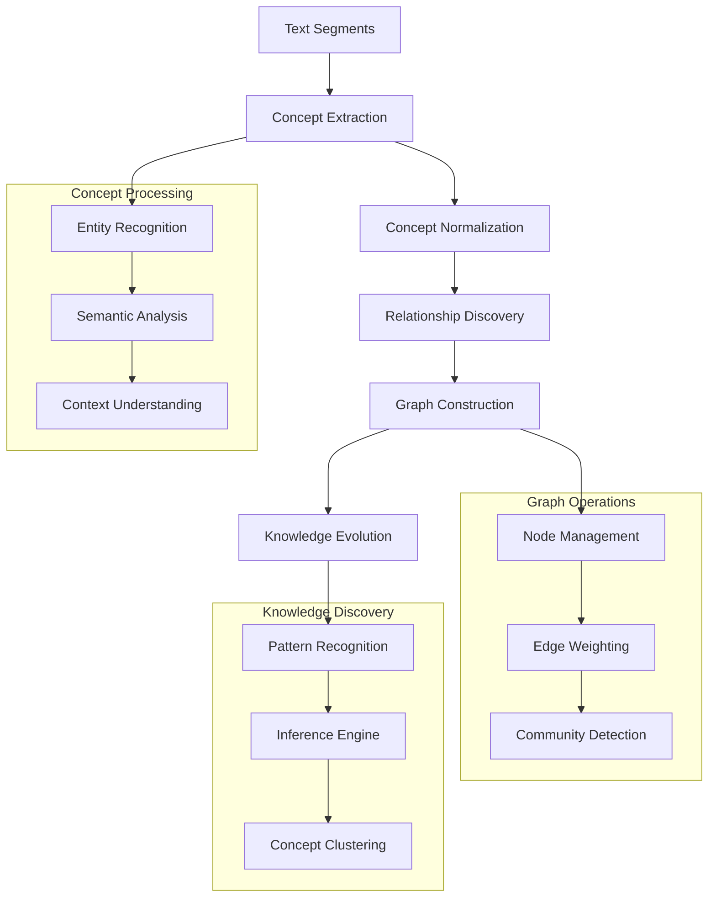

# Concept Graph Engine

The Concept Graph Engine represents the semantic understanding layer of Brain AI, automatically discovering, organizing, and connecting concepts from text to build a dynamic knowledge representation. This component transforms raw text segments into a rich, interconnected web of concepts that enables sophisticated reasoning and knowledge discovery.

## Overview

The Concept Graph Engine operates on the principle that meaning emerges from relationships between concepts. Unlike static knowledge bases, this system continuously evolves as it processes new information, discovering new concepts, strengthening existing relationships, and identifying emergent patterns in the knowledge structure.



## Core Architecture

### ConceptGraph

The central graph structure that maintains concepts and their relationships with sophisticated algorithms for knowledge discovery.

```rust
pub struct ConceptGraph {
    nodes: HashMap<ConceptId, ConceptNode>,
    edges: HashMap<EdgeId, ConceptEdge>,
    concept_index: ConceptIndex,
    relationship_tracker: RelationshipTracker,
    evolution_engine: EvolutionEngine,
    clustering_system: ClusteringSystem,
    inference_engine: InferenceEngine,
    config: ConceptGraphConfig,
}

impl ConceptGraph {
    /// Create a new concept graph
    pub fn new() -> Result<Self> {
        Ok(Self {
            nodes: HashMap::new(),
            edges: HashMap::new(),
            concept_index: ConceptIndex::new()?,
            relationship_tracker: RelationshipTracker::new(),
            evolution_engine: EvolutionEngine::new()?,
            clustering_system: ClusteringSystem::new(),
            inference_engine: InferenceEngine::new()?,
            config: ConceptGraphConfig::default(),
        })
    }
    
    /// Add or update a concept in the graph
    pub fn add_concept(&mut self, concept: ConceptData) -> Result<ConceptId> {
        // Check if concept already exists
        if let Some(existing_id) = self.concept_index.find_similar_concept(&concept)? {
            // Merge with existing concept
            let merged_concept = self.merge_concepts(existing_id, concept)?;
            self.update_concept(existing_id, merged_concept)?;
            Ok(existing_id)
        } else {
            // Create new concept
            let concept_id = self.generate_concept_id();
            let concept_node = ConceptNode {
                id: concept_id,
                data: concept,
                creation_time: SystemTime::now(),
                last_updated: SystemTime::now(),
                activation_level: 0.0,
                importance_score: 0.0,
                cluster_id: None,
                metadata: HashMap::new(),
            };
            
            self.nodes.insert(concept_id, concept_node);
            self.concept_index.index_concept(concept_id, &concept_node.data)?;
            
            Ok(concept_id)
        }
    }
    
    /// Create or strengthen relationship between concepts
    pub fn add_relationship(
        &mut self, 
        source_id: ConceptId, 
        target_id: ConceptId, 
        relationship_type: RelationshipType,
        strength: f64
    ) -> Result<EdgeId> {
        // Check if relationship already exists
        if let Some(edge_id) = self.find_existing_edge(source_id, target_id, relationship_type) {
            // Strengthen existing relationship
            self.strengthen_relationship(edge_id, strength)?;
            Ok(edge_id)
        } else {
            // Create new relationship
            let edge_id = self.generate_edge_id();
            let edge = ConceptEdge {
                id: edge_id,
                source: source_id,
                target: target_id,
                relationship_type,
                strength,
                confidence: 0.5,
                creation_time: SystemTime::now(),
                last_updated: SystemTime::now(),
                evidence_count: 1,
                metadata: HashMap::new(),
            };
            
            self.edges.insert(edge_id, edge);
            self.relationship_tracker.track_relationship(edge_id, &edge)?;
            
            // Update graph structure
            self.update_graph_structure(source_id, target_id)?;
            
            Ok(edge_id)
        }
    }
    
    /// Discover concepts from text segments
    pub fn discover_concepts(&mut self, segments: &[String]) -> Result<Vec<ConceptId>> {
        let mut discovered_concepts = Vec::new();
        
        for segment in segments {
            // Extract potential concepts using NLP techniques
            let potential_concepts = self.extract_potential_concepts(segment)?;
            
            for potential_concept in potential_concepts {
                // Validate concept quality
                if self.validate_concept_quality(&potential_concept)? {
                    let concept_id = self.add_concept(potential_concept)?;
                    discovered_concepts.push(concept_id);
                    
                    // Discover relationships with existing concepts
                    self.discover_relationships_for_concept(concept_id, segment)?;
                }
            }
        }
        
        // Trigger graph evolution if significant changes occurred
        if discovered_concepts.len() > self.config.evolution_threshold {
            self.evolution_engine.evolve_graph(self).await?;
        }
        
        Ok(discovered_concepts)
    }
    
    /// Find related concepts using graph traversal
    pub fn find_related_concepts(
        &self, 
        concept_id: ConceptId, 
        max_depth: usize,
        min_strength: f64
    ) -> Result<Vec<RelatedConcept>> {
        let mut related_concepts = Vec::new();
        let mut visited = HashSet::new();
        let mut queue = VecDeque::new();
        
        queue.push_back((concept_id, 0, 1.0)); // (id, depth, accumulated_strength)
        visited.insert(concept_id);
        
        while let Some((current_id, depth, accumulated_strength)) = queue.pop_front() {
            if depth >= max_depth {
                continue;
            }
            
            // Find all edges from current concept
            for edge in self.get_edges_from_concept(current_id)? {
                let target_id = edge.target;
                let relationship_strength = edge.strength * accumulated_strength;
                
                if relationship_strength >= min_strength && !visited.contains(&target_id) {
                    visited.insert(target_id);
                    
                    related_concepts.push(RelatedConcept {
                        concept_id: target_id,
                        relationship_path: self.build_relationship_path(concept_id, target_id)?,
                        combined_strength: relationship_strength,
                        distance: depth + 1,
                        relationship_type: edge.relationship_type,
                    });
                    
                    queue.push_back((target_id, depth + 1, relationship_strength));
                }
            }
        }
        
        // Sort by combined strength
        related_concepts.sort_by(|a, b| b.combined_strength.partial_cmp(&a.combined_strength).unwrap());
        
        Ok(related_concepts)
    }
}
```

### ConceptExtractor

Sophisticated natural language processing system for identifying concepts in text.

```rust
pub struct ConceptExtractor {
    entity_recognizer: EntityRecognizer,
    semantic_analyzer: SemanticAnalyzer,
    context_analyzer: ContextAnalyzer,
    concept_validator: ConceptValidator,
    extraction_rules: Vec<ExtractionRule>,
}

impl ConceptExtractor {
    /// Extract concepts from a text segment
    pub fn extract_concepts(&self, text: &str) -> Result<Vec<ConceptCandidate>> {
        let mut candidates = Vec::new();
        
        // Named Entity Recognition
        let entities = self.entity_recognizer.recognize_entities(text)?;
        for entity in entities {
            candidates.push(ConceptCandidate {
                text: entity.text,
                concept_type: ConceptType::Entity,
                confidence: entity.confidence,
                context: entity.context,
                extraction_method: ExtractionMethod::NER,
            });
        }
        
        // Noun phrase extraction
        let noun_phrases = self.extract_noun_phrases(text)?;
        for phrase in noun_phrases {
            candidates.push(ConceptCandidate {
                text: phrase.text,
                concept_type: ConceptType::Concept,
                confidence: phrase.confidence,
                context: phrase.context,
                extraction_method: ExtractionMethod::NounPhrase,
            });
        }
        
        // Semantic concept detection
        let semantic_concepts = self.semantic_analyzer.detect_concepts(text)?;
        for concept in semantic_concepts {
            candidates.push(ConceptCandidate {
                text: concept.text,
                concept_type: ConceptType::Abstract,
                confidence: concept.confidence,
                context: concept.context,
                extraction_method: ExtractionMethod::Semantic,
            });
        }
        
        // Apply extraction rules
        for rule in &self.extraction_rules {
            let rule_candidates = rule.apply(text)?;
            candidates.extend(rule_candidates);
        }
        
        // Filter and validate candidates
        candidates = self.concept_validator.validate_candidates(candidates)?;
        
        // Resolve conflicts and merge similar candidates
        candidates = self.resolve_candidate_conflicts(candidates)?;
        
        Ok(candidates)
    }
    
    /// Extract noun phrases using dependency parsing
    fn extract_noun_phrases(&self, text: &str) -> Result<Vec<NounPhrase>> {
        let parsed = self.semantic_analyzer.parse_dependencies(text)?;
        let mut noun_phrases = Vec::new();
        
        for sentence in parsed.sentences {
            for token in sentence.tokens {
                if token.pos_tag.starts_with("NN") { // Noun
                    let phrase = self.expand_noun_phrase(&sentence, token.index)?;
                    if phrase.tokens.len() >= 1 {
                        noun_phrases.push(NounPhrase {
                            text: phrase.text,
                            tokens: phrase.tokens,
                            head_token: token.index,
                            confidence: self.calculate_phrase_confidence(&phrase)?,
                            context: self.extract_phrase_context(&sentence, &phrase)?,
                        });
                    }
                }
            }
        }
        
        Ok(noun_phrases)
    }
}
```

### RelationshipDiscovery

Advanced system for identifying and quantifying relationships between concepts.

```rust
pub struct RelationshipDiscovery {
    pattern_matcher: PatternMatcher,
    semantic_similarity: SemanticSimilarity,
    co_occurrence_analyzer: CoOccurrenceAnalyzer,
    syntactic_analyzer: SyntacticAnalyzer,
    relationship_classifier: RelationshipClassifier,
}

impl RelationshipDiscovery {
    /// Discover relationships between concepts in text
    pub fn discover_relationships(
        &self, 
        concepts: &[ConceptData], 
        text: &str
    ) -> Result<Vec<DiscoveredRelationship>> {
        let mut relationships = Vec::new();
        
        // Pattern-based relationship discovery
        for pattern in self.pattern_matcher.get_patterns() {
            let pattern_matches = pattern.find_relationships(concepts, text)?;
            relationships.extend(pattern_matches);
        }
        
        // Co-occurrence analysis
        let co_occurrences = self.co_occurrence_analyzer.analyze(concepts, text)?;
        for co_occurrence in co_occurrences {
            if co_occurrence.significance > 0.5 {
                relationships.push(DiscoveredRelationship {
                    source: co_occurrence.concept1,
                    target: co_occurrence.concept2,
                    relationship_type: RelationshipType::CoOccurrence,
                    strength: co_occurrence.significance,
                    confidence: co_occurrence.confidence,
                    evidence: vec![co_occurrence.evidence],
                    discovery_method: DiscoveryMethod::CoOccurrence,
                });
            }
        }
        
        // Syntactic relationship analysis
        let syntactic_relations = self.syntactic_analyzer.analyze_syntax(concepts, text)?;
        for relation in syntactic_relations {
            relationships.push(DiscoveredRelationship {
                source: relation.subject,
                target: relation.object,
                relationship_type: self.classify_syntactic_relationship(&relation)?,
                strength: relation.confidence,
                confidence: relation.confidence,
                evidence: vec![relation.evidence],
                discovery_method: DiscoveryMethod::Syntactic,
            });
        }
        
        // Semantic similarity relationships
        for i in 0..concepts.len() {
            for j in i+1..concepts.len() {
                let similarity = self.semantic_similarity.calculate_similarity(
                    &concepts[i], 
                    &concepts[j]
                )?;
                
                if similarity > 0.7 {
                    relationships.push(DiscoveredRelationship {
                        source: concepts[i].id,
                        target: concepts[j].id,
                        relationship_type: RelationshipType::Similarity,
                        strength: similarity,
                        confidence: similarity,
                        evidence: vec!["Semantic similarity analysis".to_string()],
                        discovery_method: DiscoveryMethod::Semantic,
                    });
                }
            }
        }
        
        // Classify and filter relationships
        relationships = self.relationship_classifier.classify_relationships(relationships)?;
        relationships = self.filter_low_quality_relationships(relationships)?;
        
        Ok(relationships)
    }
    
    /// Discover hierarchical relationships (is-a, part-of)
    pub fn discover_hierarchical_relationships(
        &self, 
        concepts: &[ConceptData]
    ) -> Result<Vec<HierarchicalRelationship>> {
        let mut hierarchical_relations = Vec::new();
        
        for concept in concepts {
            // Look for hypernym patterns
            let hypernyms = self.find_hypernyms(concept)?;
            for hypernym in hypernyms {
                hierarchical_relations.push(HierarchicalRelationship {
                    child: concept.id,
                    parent: hypernym.id,
                    relationship_type: HierarchyType::IsA,
                    confidence: hypernym.confidence,
                    evidence: hypernym.evidence,
                });
            }
            
            // Look for meronym patterns (part-of relationships)
            let meronyms = self.find_meronyms(concept)?;
            for meronym in meronyms {
                hierarchical_relations.push(HierarchicalRelationship {
                    child: concept.id,
                    parent: meronym.whole_id,
                    relationship_type: HierarchyType::PartOf,
                    confidence: meronym.confidence,
                    evidence: meronym.evidence,
                });
            }
        }
        
        Ok(hierarchical_relations)
    }
}
```

## Key Algorithms

### 1. Concept Clustering Algorithm

Groups related concepts into semantic clusters for better organization and understanding:

```rust
pub struct ConceptClustering {
    similarity_threshold: f64,
    cluster_algorithm: ClusterAlgorithm,
    feature_extractor: FeatureExtractor,
    cluster_validator: ClusterValidator,
}

impl ConceptClustering {
    /// Cluster concepts based on semantic similarity
    pub fn cluster_concepts(&self, concepts: &[ConceptNode]) -> Result<Vec<ConceptCluster>> {
        // Extract features for each concept
        let mut feature_vectors = Vec::new();
        for concept in concepts {
            let features = self.feature_extractor.extract_features(concept)?;
            feature_vectors.push((concept.id, features));
        }
        
        // Apply clustering algorithm
        let clusters = match self.cluster_algorithm {
            ClusterAlgorithm::KMeans => self.kmeans_clustering(&feature_vectors)?,
            ClusterAlgorithm::Hierarchical => self.hierarchical_clustering(&feature_vectors)?,
            ClusterAlgorithm::DBSCAN => self.dbscan_clustering(&feature_vectors)?,
            ClusterAlgorithm::SpectralClustering => self.spectral_clustering(&feature_vectors)?,
        };
        
        // Validate and refine clusters
        let validated_clusters = self.cluster_validator.validate_clusters(clusters, concepts)?;
        
        // Generate cluster metadata
        let final_clusters = self.generate_cluster_metadata(validated_clusters, concepts)?;
        
        Ok(final_clusters)
    }
    
    /// Hierarchical clustering implementation
    fn hierarchical_clustering(&self, feature_vectors: &[(ConceptId, Vec<f64>)]) -> Result<Vec<RawCluster>> {
        let mut clusters: Vec<RawCluster> = feature_vectors.iter()
            .map(|(id, _)| RawCluster { concept_ids: vec![*id] })
            .collect();
        
        while clusters.len() > 1 {
            let mut min_distance = f64::INFINITY;
            let mut merge_indices = (0, 1);
            
            // Find closest pair of clusters
            for i in 0..clusters.len() {
                for j in i+1..clusters.len() {
                    let distance = self.calculate_cluster_distance(&clusters[i], &clusters[j], feature_vectors)?;
                    if distance < min_distance {
                        min_distance = distance;
                        merge_indices = (i, j);
                    }
                }
            }
            
            // Stop if minimum distance exceeds threshold
            if min_distance > self.similarity_threshold {
                break;
            }
            
            // Merge closest clusters
            let (i, j) = merge_indices;
            let mut merged_cluster = clusters[i].clone();
            merged_cluster.concept_ids.extend(clusters[j].concept_ids.clone());
            
            // Remove original clusters and add merged cluster
            clusters.remove(j); // Remove j first (higher index)
            clusters.remove(i);
            clusters.push(merged_cluster);
        }
        
        Ok(clusters)
    }
}
```

### 2. Graph Evolution Algorithm

Continuously evolves the concept graph structure based on new information and usage patterns:

```rust
pub struct GraphEvolution {
    evolution_strategies: Vec<EvolutionStrategy>,
    pruning_algorithm: PruningAlgorithm,
    consolidation_engine: ConsolidationEngine,
    quality_assessor: QualityAssessor,
}

impl GraphEvolution {
    /// Evolve the graph structure
    pub async fn evolve_graph(&self, graph: &mut ConceptGraph) -> Result<EvolutionStats> {
        let mut evolution_stats = EvolutionStats::new();
        
        // Apply evolution strategies
        for strategy in &self.evolution_strategies {
            let strategy_result = strategy.apply(graph).await?;
            evolution_stats.merge(strategy_result);
        }
        
        // Prune weak or redundant connections
        let pruning_result = self.pruning_algorithm.prune_graph(graph)?;
        evolution_stats.nodes_removed += pruning_result.nodes_removed;
        evolution_stats.edges_removed += pruning_result.edges_removed;
        
        // Consolidate similar concepts
        let consolidation_result = self.consolidation_engine.consolidate_concepts(graph).await?;
        evolution_stats.concepts_merged += consolidation_result.concepts_merged;
        
        // Assess overall graph quality
        let quality_metrics = self.quality_assessor.assess_graph_quality(graph)?;
        evolution_stats.quality_score = quality_metrics.overall_score;
        
        Ok(evolution_stats)
    }
    
    /// Strengthen frequently used pathways
    async fn strengthen_pathways(&self, graph: &mut ConceptGraph) -> Result<PathwayStats> {
        let mut pathway_stats = PathwayStats::new();
        
        // Identify frequently traversed paths
        let frequent_paths = graph.get_frequent_traversal_paths()?;
        
        for path in frequent_paths {
            if path.usage_frequency > self.config.pathway_strengthening_threshold {
                // Strengthen edges in the path
                for edge_id in path.edge_ids {
                    if let Some(edge) = graph.edges.get_mut(&edge_id) {
                        let strengthening_factor = (path.usage_frequency * 0.1).min(0.2);
                        edge.strength = (edge.strength + strengthening_factor).min(1.0);
                        pathway_stats.edges_strengthened += 1;
                    }
                }
                
                // Create shortcut connections for long paths
                if path.length > 3 {
                    let shortcut_strength = path.average_strength * 0.7;
                    graph.add_relationship(
                        path.start_concept,
                        path.end_concept,
                        RelationshipType::Derived,
                        shortcut_strength
                    )?;
                    pathway_stats.shortcuts_created += 1;
                }
            }
        }
        
        Ok(pathway_stats)
    }
}
```

### 3. Inference Engine

Performs logical reasoning over the concept graph to derive new knowledge:

```rust
pub struct InferenceEngine {
    inference_rules: Vec<InferenceRule>,
    reasoning_strategies: Vec<ReasoningStrategy>,
    confidence_calculator: ConfidenceCalculator,
    contradiction_detector: ContradictionDetector,
}

impl InferenceEngine {
    /// Perform inference to derive new relationships
    pub fn perform_inference(&self, graph: &ConceptGraph) -> Result<Vec<InferredRelationship>> {
        let mut inferred_relationships = Vec::new();
        
        // Apply inference rules
        for rule in &self.inference_rules {
            let rule_inferences = rule.apply(graph)?;
            inferred_relationships.extend(rule_inferences);
        }
        
        // Apply reasoning strategies
        for strategy in &self.reasoning_strategies {
            let strategy_inferences = strategy.reason(graph)?;
            inferred_relationships.extend(strategy_inferences);
        }
        
        // Calculate confidence for inferred relationships
        for inference in &mut inferred_relationships {
            inference.confidence = self.confidence_calculator.calculate_confidence(inference, graph)?;
        }
        
        // Filter low-confidence inferences
        inferred_relationships.retain(|inf| inf.confidence > 0.5);
        
        // Detect and resolve contradictions
        inferred_relationships = self.contradiction_detector.resolve_contradictions(
            inferred_relationships, 
            graph
        )?;
        
        Ok(inferred_relationships)
    }
    
    /// Transitive reasoning (if A relates to B and B relates to C, then A relates to C)
    fn transitive_reasoning(&self, graph: &ConceptGraph) -> Result<Vec<InferredRelationship>> {
        let mut transitive_inferences = Vec::new();
        
        for (concept_a, edges_from_a) in graph.get_all_outgoing_edges() {
            for edge_ab in edges_from_a {
                let concept_b = edge_ab.target;
                
                if let Some(edges_from_b) = graph.get_outgoing_edges(concept_b) {
                    for edge_bc in edges_from_b {
                        let concept_c = edge_bc.target;
                        
                        // Check if transitive relationship is valid
                        if self.is_transitive_valid(edge_ab.relationship_type, edge_bc.relationship_type) {
                            let transitive_strength = edge_ab.strength * edge_bc.strength * 0.8; // Decay factor
                            
                            if transitive_strength > 0.3 { // Minimum threshold
                                transitive_inferences.push(InferredRelationship {
                                    source: concept_a,
                                    target: concept_c,
                                    relationship_type: self.derive_transitive_type(
                                        edge_ab.relationship_type, 
                                        edge_bc.relationship_type
                                    ),
                                    strength: transitive_strength,
                                    confidence: 0.0, // Will be calculated later
                                    evidence_path: vec![edge_ab.id, edge_bc.id],
                                    inference_method: InferenceMethod::Transitive,
                                });
                            }
                        }
                    }
                }
            }
        }
        
        Ok(transitive_inferences)
    }
}
```

## Configuration Options

The Concept Graph Engine supports extensive configuration:

```toml
[components.concept_graph]
# Graph Structure
max_concepts = 100000           # Maximum number of concepts
max_relationships = 500000     # Maximum number of relationships
concept_similarity_threshold = 0.8  # Threshold for concept merging
relationship_strength_threshold = 0.3  # Minimum relationship strength

# Concept Extraction
enable_ner = true              # Enable named entity recognition
enable_noun_phrases = true     # Enable noun phrase extraction
enable_semantic_concepts = true  # Enable semantic concept detection
concept_validation_threshold = 0.6  # Minimum confidence for concepts

# Relationship Discovery
enable_pattern_matching = true  # Enable pattern-based discovery
enable_co_occurrence = true    # Enable co-occurrence analysis
enable_syntactic_analysis = true  # Enable syntactic relationship discovery
co_occurrence_window = 5       # Window size for co-occurrence analysis

# Graph Evolution
evolution_interval = 3600      # Evolution interval in seconds
pathway_strengthening = true   # Enable pathway strengthening
concept_consolidation = true   # Enable concept consolidation
pruning_threshold = 0.1       # Threshold for pruning weak connections

# Clustering
clustering_algorithm = "hierarchical"  # hierarchical, kmeans, dbscan, spectral
cluster_similarity_threshold = 0.7     # Similarity threshold for clustering
min_cluster_size = 3                   # Minimum concepts per cluster
max_clusters = 50                      # Maximum number of clusters

# Inference
enable_transitive_reasoning = true     # Enable transitive inference
enable_analogical_reasoning = true     # Enable analogical inference
inference_confidence_threshold = 0.5   # Minimum confidence for inferences
max_inference_depth = 3               # Maximum depth for inference chains

# Performance
enable_caching = true          # Enable result caching
cache_size = 10000            # Cache size for queries
parallel_processing = true     # Enable parallel concept processing
batch_size = 100             # Batch size for bulk operations
```

## Usage Examples

### Basic Concept Discovery

```rust
use brain::concept_graph::{ConceptGraph, ConceptData, ConceptType};

// Create concept graph
let mut concept_graph = ConceptGraph::new()?;

// Discover concepts from text segments
let text_segments = vec![
    "Machine learning is a subset of artificial intelligence".to_string(),
    "Neural networks are used in deep learning applications".to_string(),
    "Data science involves statistical analysis and machine learning".to_string(),
];

let discovered_concepts = concept_graph.discover_concepts(&text_segments)?;
println!("Discovered {} concepts", discovered_concepts.len());

// Query related concepts
for concept_id in discovered_concepts {
    let related = concept_graph.find_related_concepts(concept_id, 2, 0.3)?;
    println!("Concept {} has {} related concepts", concept_id, related.len());
}
```

### Advanced Relationship Discovery

```rust
use brain::concept_graph::{RelationshipType, RelationshipDiscovery};

// Create relationship discovery system
let relationship_discovery = RelationshipDiscovery::new()?;

// Add concepts manually
let ml_concept = concept_graph.add_concept(ConceptData {
    name: "machine learning".to_string(),
    concept_type: ConceptType::Abstract,
    description: Some("A method of data analysis that automates analytical model building".to_string()),
    aliases: vec!["ML".to_string()],
    ..Default::default()
})?;

let ai_concept = concept_graph.add_concept(ConceptData {
    name: "artificial intelligence".to_string(),
    concept_type: ConceptType::Abstract,
    description: Some("Intelligence demonstrated by machines".to_string()),
    aliases: vec!["AI".to_string()],
    ..Default::default()
})?;

// Create relationship
let relationship_id = concept_graph.add_relationship(
    ml_concept,
    ai_concept,
    RelationshipType::SubsetOf,
    0.9
)?;

println!("Created relationship: {}", relationship_id);
```

### Concept Clustering and Analysis

```rust
use brain::concept_graph::{ConceptClustering, ClusterAlgorithm};

// Perform concept clustering
let clustering = ConceptClustering::new(ClusterAlgorithm::Hierarchical)?;
let clusters = clustering.cluster_concepts(&concept_graph.get_all_concepts()?)?;

println!("Found {} clusters", clusters.len());

for cluster in clusters {
    println!("Cluster '{}' contains {} concepts:", cluster.name, cluster.concept_ids.len());
    for concept_id in cluster.concept_ids {
        if let Some(concept) = concept_graph.get_concept(concept_id)? {
            println!("  - {}", concept.data.name);
        }
    }
}
```

The Concept Graph Engine provides sophisticated knowledge representation and reasoning capabilities that enable Brain AI to understand and work with complex conceptual relationships in a human-like manner.
