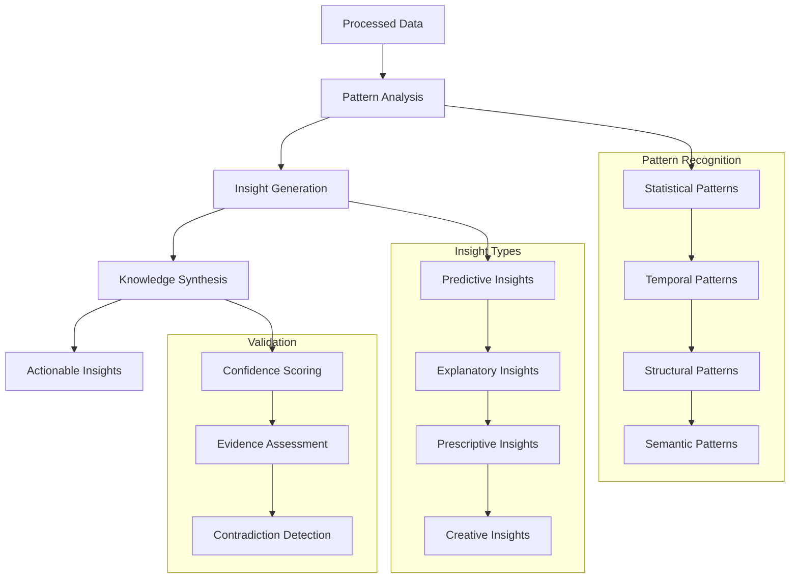

# Insight Extraction Engine

The Insight Extraction Engine represents the analytical intelligence layer of Brain AI, automatically discovering patterns, generating insights, and extracting meaningful knowledge from processed information. This component transforms raw data and learned patterns into actionable understanding that drives intelligent decision-making and knowledge discovery.

## Overview

The Insight Extraction Engine operates on the principle that intelligence emerges from the ability to recognize patterns, make connections, and generate novel insights from existing knowledge. Unlike simple pattern matching systems, this engine employs sophisticated analytical algorithms to discover hidden relationships, predict trends, and generate creative solutions.



## Core Architecture

### InsightExtractor

The central system that orchestrates pattern discovery, insight generation, and knowledge synthesis.

```rust
pub struct InsightExtractor {
    pattern_analyzers: Vec<Box<dyn PatternAnalyzer>>,
    insight_generators: Vec<Box<dyn InsightGenerator>>,
    knowledge_synthesizer: KnowledgeSynthesizer,
    validation_engine: ValidationEngine,
    confidence_calculator: ConfidenceCalculator,
    insight_repository: InsightRepository,
    meta_learner: MetaLearner,
    config: InsightConfig,
}

impl InsightExtractor {
    /// Extract insights from processed data
    pub fn extract_insights(&mut self, data: &ProcessedData) -> Result<Vec<Insight>> {
        let mut all_insights = Vec::new();
        
        // Analyze patterns using different analyzers
        let mut discovered_patterns = Vec::new();
        for analyzer in &self.pattern_analyzers {
            let patterns = analyzer.analyze_patterns(data)?;
            discovered_patterns.extend(patterns);
        }
        
        // Generate insights from patterns
        for generator in &self.insight_generators {
            let insights = generator.generate_insights(&discovered_patterns, data)?;
            all_insights.extend(insights);
        }
        
        // Synthesize knowledge from insights
        let synthesized_insights = self.knowledge_synthesizer.synthesize_knowledge(&all_insights)?;
        all_insights.extend(synthesized_insights);
        
        // Validate and score insights
        let mut validated_insights = Vec::new();
        for mut insight in all_insights {
            let validation_result = self.validation_engine.validate_insight(&insight)?;
            if validation_result.is_valid {
                insight.confidence = self.confidence_calculator.calculate_confidence(&insight)?;
                insight.validation_score = validation_result.score;
                validated_insights.push(insight);
            }
        }
        
        // Filter by minimum confidence threshold
        validated_insights.retain(|insight| insight.confidence >= self.config.min_confidence);
        
        // Store insights for future reference
        for insight in &validated_insights {
            self.insight_repository.store_insight(insight.clone())?;
        }
        
        // Update meta-learning models
        self.meta_learner.learn_from_insights(&validated_insights)?;
        
        // Sort by importance and confidence
        validated_insights.sort_by(|a, b| {
            (b.importance * b.confidence).partial_cmp(&(a.importance * a.confidence)).unwrap()
        });
        
        Ok(validated_insights)
    }
    
    /// Generate predictive insights based on historical patterns
    pub fn generate_predictions(&self, context: &PredictionContext) -> Result<Vec<PredictiveInsight>> {
        let historical_patterns = self.insight_repository.get_historical_patterns(&context)?;
        let mut predictions = Vec::new();
        
        for pattern in historical_patterns {
            if pattern.confidence > 0.7 && pattern.occurrences > 5 {
                let prediction = self.extrapolate_pattern(&pattern, context)?;
                if prediction.confidence > self.config.min_prediction_confidence {
                    predictions.push(prediction);
                }
            }
        }
        
        // Apply ensemble methods for better predictions
        predictions = self.apply_ensemble_predictions(predictions)?;
        
        Ok(predictions)
    }
    
    /// Discover causal relationships in data
    pub fn discover_causality(&self, data: &ProcessedData) -> Result<Vec<CausalInsight>> {
        let causal_analyzer = CausalAnalyzer::new(&self.config.causality_config)?;
        
        // Identify potential causal relationships
        let causal_candidates = causal_analyzer.identify_causal_candidates(data)?;
        
        // Test causal hypotheses
        let mut causal_insights = Vec::new();
        for candidate in causal_candidates {
            let causal_strength = causal_analyzer.test_causality(&candidate, data)?;
            if causal_strength.significance > 0.05 { // p-value threshold
                causal_insights.push(CausalInsight {
                    cause: candidate.cause,
                    effect: candidate.effect,
                    strength: causal_strength.strength,
                    confidence: causal_strength.confidence,
                    evidence: causal_strength.evidence,
                    mechanism: causal_analyzer.infer_mechanism(&candidate)?,
                });
            }
        }
        
        Ok(causal_insights)
    }
}
```

### PatternAnalyzer

Sophisticated pattern recognition system that identifies various types of patterns in data.

```rust
pub trait PatternAnalyzer: Send + Sync {
    fn analyze_patterns(&self, data: &ProcessedData) -> Result<Vec<Pattern>>;
    fn get_pattern_types(&self) -> Vec<PatternType>;
}

pub struct StatisticalPatternAnalyzer {
    statistical_tests: Vec<StatisticalTest>,
    correlation_analyzer: CorrelationAnalyzer,
    distribution_analyzer: DistributionAnalyzer,
    anomaly_detector: AnomalyDetector,
}

impl PatternAnalyzer for StatisticalPatternAnalyzer {
    fn analyze_patterns(&self, data: &ProcessedData) -> Result<Vec<Pattern>> {
        let mut patterns = Vec::new();
        
        // Correlation analysis
        let correlations = self.correlation_analyzer.find_correlations(data)?;
        for correlation in correlations {
            if correlation.strength.abs() > 0.5 {
                patterns.push(Pattern {
                    pattern_type: PatternType::Correlation,
                    description: format!("Strong correlation ({:.2}) between {} and {}", 
                                       correlation.strength, correlation.var1, correlation.var2),
                    confidence: correlation.p_value.map(|p| 1.0 - p).unwrap_or(0.5),
                    evidence: correlation.evidence,
                    metadata: correlation.metadata,
                });
            }
        }
        
        // Distribution analysis
        let distributions = self.distribution_analyzer.analyze_distributions(data)?;
        for dist in distributions {
            if dist.goodness_of_fit > 0.8 {
                patterns.push(Pattern {
                    pattern_type: PatternType::Distribution,
                    description: format!("Data follows {} distribution (fit: {:.2})", 
                                       dist.distribution_type, dist.goodness_of_fit),
                    confidence: dist.goodness_of_fit,
                    evidence: dist.evidence,
                    metadata: dist.parameters,
                });
            }
        }
        
        // Anomaly detection
        let anomalies = self.anomaly_detector.detect_anomalies(data)?;
        for anomaly in anomalies {
            if anomaly.anomaly_score > 0.8 {
                patterns.push(Pattern {
                    pattern_type: PatternType::Anomaly,
                    description: format!("Anomaly detected: {} (score: {:.2})", 
                                       anomaly.description, anomaly.anomaly_score),
                    confidence: anomaly.anomaly_score,
                    evidence: anomaly.evidence,
                    metadata: anomaly.context,
                });
            }
        }
        
        Ok(patterns)
    }
}

pub struct TemporalPatternAnalyzer {
    trend_detector: TrendDetector,
    seasonality_detector: SeasonalityDetector,
    cycle_detector: CycleDetector,
    change_point_detector: ChangePointDetector,
}

impl PatternAnalyzer for TemporalPatternAnalyzer {
    fn analyze_patterns(&self, data: &ProcessedData) -> Result<Vec<Pattern>> {
        let mut patterns = Vec::new();
        
        // Trend analysis
        let trends = self.trend_detector.detect_trends(data)?;
        for trend in trends {
            patterns.push(Pattern {
                pattern_type: PatternType::Trend,
                description: format!("{} trend detected (slope: {:.3}, R²: {:.3})", 
                                   trend.direction, trend.slope, trend.r_squared),
                confidence: trend.significance,
                evidence: trend.evidence,
                metadata: trend.metadata,
            });
        }
        
        // Seasonality detection
        let seasonal_patterns = self.seasonality_detector.detect_seasonality(data)?;
        for seasonal in seasonal_patterns {
            patterns.push(Pattern {
                pattern_type: PatternType::Seasonality,
                description: format!("Seasonal pattern with period {} (strength: {:.2})", 
                                   seasonal.period, seasonal.strength),
                confidence: seasonal.significance,
                evidence: seasonal.evidence,
                metadata: seasonal.metadata,
            });
        }
        
        // Change point detection
        let change_points = self.change_point_detector.detect_change_points(data)?;
        for change_point in change_points {
            patterns.push(Pattern {
                pattern_type: PatternType::ChangePoint,
                description: format!("Significant change detected at {} (magnitude: {:.2})", 
                                   change_point.timestamp, change_point.magnitude),
                confidence: change_point.confidence,
                evidence: change_point.evidence,
                metadata: change_point.metadata,
            });
        }
        
        Ok(patterns)
    }
}
```

### InsightGenerator

Generates actionable insights from discovered patterns using various analytical approaches.

```rust
pub trait InsightGenerator: Send + Sync {
    fn generate_insights(&self, patterns: &[Pattern], data: &ProcessedData) -> Result<Vec<Insight>>;
    fn get_insight_types(&self) -> Vec<InsightType>;
}

pub struct PredictiveInsightGenerator {
    forecasting_models: Vec<Box<dyn ForecastingModel>>,
    trend_extrapolator: TrendExtrapolator,
    pattern_matcher: PatternMatcher,
}

impl InsightGenerator for PredictiveInsightGenerator {
    fn generate_insights(&self, patterns: &[Pattern], data: &ProcessedData) -> Result<Vec<Insight>> {
        let mut insights = Vec::new();
        
        // Generate trend-based predictions
        for pattern in patterns {
            if pattern.pattern_type == PatternType::Trend {
                let prediction = self.trend_extrapolator.extrapolate_trend(pattern, data)?;
                insights.push(Insight {
                    insight_type: InsightType::Predictive,
                    title: format!("Trend Prediction: {}", pattern.description),
                    description: prediction.description,
                    confidence: prediction.confidence,
                    importance: self.calculate_trend_importance(pattern)?,
                    evidence: prediction.evidence,
                    actionable_recommendations: prediction.recommendations,
                    metadata: prediction.metadata,
                });
            }
        }
        
        // Generate forecasts using multiple models
        for model in &self.forecasting_models {
            let forecast = model.generate_forecast(data)?;
            if forecast.confidence > 0.6 {
                insights.push(Insight {
                    insight_type: InsightType::Predictive,
                    title: format!("Forecast: {}", forecast.title),
                    description: forecast.description,
                    confidence: forecast.confidence,
                    importance: forecast.importance,
                    evidence: forecast.evidence,
                    actionable_recommendations: forecast.recommendations,
                    metadata: forecast.metadata,
                });
            }
        }
        
        Ok(insights)
    }
}

pub struct ExplanatoryInsightGenerator {
    causal_analyzer: CausalAnalyzer,
    correlation_explainer: CorrelationExplainer,
    anomaly_explainer: AnomalyExplainer,
}

impl InsightGenerator for ExplanatoryInsightGenerator {
    fn generate_insights(&self, patterns: &[Pattern], data: &ProcessedData) -> Result<Vec<Insight>> {
        let mut insights = Vec::new();
        
        // Explain correlations
        for pattern in patterns {
            if pattern.pattern_type == PatternType::Correlation {
                let explanation = self.correlation_explainer.explain_correlation(pattern, data)?;
                insights.push(Insight {
                    insight_type: InsightType::Explanatory,
                    title: format!("Correlation Explanation: {}", pattern.description),
                    description: explanation.description,
                    confidence: explanation.confidence,
                    importance: explanation.importance,
                    evidence: explanation.evidence,
                    actionable_recommendations: explanation.implications,
                    metadata: explanation.metadata,
                });
            }
        }
        
        // Explain anomalies
        for pattern in patterns {
            if pattern.pattern_type == PatternType::Anomaly {
                let explanation = self.anomaly_explainer.explain_anomaly(pattern, data)?;
                insights.push(Insight {
                    insight_type: InsightType::Explanatory,
                    title: format!("Anomaly Explanation: {}", pattern.description),
                    description: explanation.description,
                    confidence: explanation.confidence,
                    importance: explanation.importance,
                    evidence: explanation.evidence,
                    actionable_recommendations: explanation.recommendations,
                    metadata: explanation.metadata,
                });
            }
        }
        
        Ok(insights)
    }
}
```

## Key Algorithms

### 1. Causal Discovery Algorithm

Advanced algorithm for discovering causal relationships in observational data:

```rust
pub struct CausalDiscovery {
    independence_tester: IndependenceTester,
    constraint_solver: ConstraintSolver,
    score_function: ScoreFunction,
    intervention_analyzer: InterventionAnalyzer,
}

impl CausalDiscovery {
    /// Discover causal structure using constraint-based approach
    pub fn discover_causal_structure(&self, data: &ProcessedData) -> Result<CausalGraph> {
        // Step 1: Learn skeleton using conditional independence tests
        let skeleton = self.learn_skeleton(data)?;
        
        // Step 2: Orient edges using v-structures
        let partially_oriented = self.orient_v_structures(&skeleton, data)?;
        
        // Step 3: Apply orientation rules
        let oriented_graph = self.apply_orientation_rules(&partially_oriented)?;
        
        // Step 4: Validate using score-based approach
        let validated_graph = self.validate_with_scoring(&oriented_graph, data)?;
        
        Ok(validated_graph)
    }
    
    /// Learn skeleton of causal graph
    fn learn_skeleton(&self, data: &ProcessedData) -> Result<UndirectedGraph> {
        let variables = data.get_variables();
        let mut graph = UndirectedGraph::complete(&variables);
        
        // Test conditional independence for each pair of variables
        for i in 0..variables.len() {
            for j in i+1..variables.len() {
                let var_i = &variables[i];
                let var_j = &variables[j];
                
                // Test independence conditioning on increasing sets
                for conditioning_set_size in 0..variables.len()-2 {
                    let conditioning_sets = self.generate_conditioning_sets(
                        &variables, var_i, var_j, conditioning_set_size
                    );
                    
                    for conditioning_set in conditioning_sets {
                        let independence_result = self.independence_tester.test_independence(
                            var_i, var_j, &conditioning_set, data
                        )?;
                        
                        if independence_result.is_independent() {
                            graph.remove_edge(var_i, var_j);
                            break;
                        }
                    }
                    
                    if !graph.has_edge(var_i, var_j) {
                        break;
                    }
                }
            }
        }
        
        Ok(graph)
    }
    
    /// Orient v-structures (X -> Z <- Y where X and Y are not adjacent)
    fn orient_v_structures(&self, skeleton: &UndirectedGraph, data: &ProcessedData) -> Result<PartiallyOrientedGraph> {
        let mut oriented_graph = PartiallyOrientedGraph::from_skeleton(skeleton);
        
        for triple in skeleton.get_all_triples() {
            let (x, z, y) = triple;
            
            // Check if X and Y are not adjacent (v-structure candidate)
            if !skeleton.has_edge(&x, &y) {
                // Test if Z is in the conditioning set that made X and Y independent
                let conditioning_sets = self.get_conditioning_sets_for_pair(&x, &y);
                
                let mut z_in_conditioning_set = false;
                for conditioning_set in conditioning_sets {
                    if conditioning_set.contains(&z) {
                        z_in_conditioning_set = true;
                        break;
                    }
                }
                
                // If Z was not in any conditioning set, orient as X -> Z <- Y
                if !z_in_conditioning_set {
                    oriented_graph.orient_edge(&x, &z, EdgeDirection::Forward);
                    oriented_graph.orient_edge(&y, &z, EdgeDirection::Forward);
                }
            }
        }
        
        Ok(oriented_graph)
    }
}
```

### 2. Insight Synthesis Algorithm

Combines multiple insights to generate higher-level understanding:

```rust
pub struct InsightSynthesis {
    synthesis_strategies: Vec<Box<dyn SynthesisStrategy>>,
    conflict_resolver: ConflictResolver,
    importance_calculator: ImportanceCalculator,
    novelty_detector: NoveltyDetector,
}

impl InsightSynthesis {
    /// Synthesize insights to generate meta-insights
    pub fn synthesize_insights(&self, insights: &[Insight]) -> Result<Vec<MetaInsight>> {
        let mut meta_insights = Vec::new();
        
        // Apply different synthesis strategies
        for strategy in &self.synthesis_strategies {
            let synthesized = strategy.synthesize(insights)?;
            meta_insights.extend(synthesized);
        }
        
        // Resolve conflicts between insights
        meta_insights = self.conflict_resolver.resolve_conflicts(meta_insights)?;
        
        // Calculate importance and novelty
        for meta_insight in &mut meta_insights {
            meta_insight.importance = self.importance_calculator.calculate_importance(meta_insight)?;
            meta_insight.novelty = self.novelty_detector.calculate_novelty(meta_insight)?;
        }
        
        // Filter by minimum importance threshold
        meta_insights.retain(|insight| insight.importance > 0.5);
        
        Ok(meta_insights)
    }
}

pub struct PatternCombinationStrategy {
    combination_rules: Vec<CombinationRule>,
    pattern_matcher: PatternMatcher,
}

impl SynthesisStrategy for PatternCombinationStrategy {
    fn synthesize(&self, insights: &[Insight]) -> Result<Vec<MetaInsight>> {
        let mut meta_insights = Vec::new();
        
        // Find patterns that can be combined
        for rule in &self.combination_rules {
            let matching_insights = self.pattern_matcher.find_matching_insights(insights, &rule.pattern)?;
            
            if matching_insights.len() >= rule.min_instances {
                let combined_insight = self.combine_insights(&matching_insights, rule)?;
                meta_insights.push(combined_insight);
            }
        }
        
        Ok(meta_insights)
    }
    
    fn combine_insights(&self, insights: &[&Insight], rule: &CombinationRule) -> Result<MetaInsight> {
        let combined_confidence = self.calculate_combined_confidence(insights)?;
        let combined_evidence = self.merge_evidence(insights)?;
        let emergent_properties = self.identify_emergent_properties(insights, rule)?;
        
        Ok(MetaInsight {
            insight_type: InsightType::Synthetic,
            title: rule.generate_title(insights)?,
            description: rule.generate_description(insights, &emergent_properties)?,
            confidence: combined_confidence,
            importance: 0.0, // Will be calculated later
            novelty: 0.0, // Will be calculated later
            component_insights: insights.iter().map(|i| i.id).collect(),
            emergent_properties,
            evidence: combined_evidence,
            synthesis_method: rule.name.clone(),
        })
    }
}
```

### 3. Insight Validation Algorithm

Validates insights for accuracy, consistency, and actionability:

```rust
pub struct InsightValidation {
    consistency_checker: ConsistencyChecker,
    evidence_validator: EvidenceValidator,
    actionability_assessor: ActionabilityAssessor,
    bias_detector: BiasDetector,
}

impl InsightValidation {
    /// Validate an insight across multiple dimensions
    pub fn validate_insight(&self, insight: &Insight) -> Result<ValidationResult> {
        let mut validation_result = ValidationResult::new();
        
        // Check logical consistency
        let consistency_result = self.consistency_checker.check_consistency(insight)?;
        validation_result.consistency_score = consistency_result.score;
        validation_result.consistency_issues = consistency_result.issues;
        
        // Validate evidence quality
        let evidence_result = self.evidence_validator.validate_evidence(&insight.evidence)?;
        validation_result.evidence_score = evidence_result.score;
        validation_result.evidence_quality = evidence_result.quality_metrics;
        
        // Assess actionability
        let actionability_result = self.actionability_assessor.assess_actionability(insight)?;
        validation_result.actionability_score = actionability_result.score;
        validation_result.actionability_barriers = actionability_result.barriers;
        
        // Detect potential biases
        let bias_result = self.bias_detector.detect_biases(insight)?;
        validation_result.bias_score = bias_result.score;
        validation_result.detected_biases = bias_result.biases;
        
        // Calculate overall validation score
        validation_result.overall_score = self.calculate_overall_score(&validation_result)?;
        validation_result.is_valid = validation_result.overall_score > 0.6;
        
        Ok(validation_result)
    }
    
    /// Check for logical consistency within an insight
    fn check_logical_consistency(&self, insight: &Insight) -> Result<ConsistencyResult> {
        let mut issues = Vec::new();
        let mut score = 1.0;
        
        // Check for internal contradictions
        if let Some(contradictions) = self.find_internal_contradictions(insight)? {
            issues.extend(contradictions);
            score *= 0.5;
        }
        
        // Check consistency with established knowledge
        if let Some(knowledge_conflicts) = self.check_knowledge_consistency(insight)? {
            issues.extend(knowledge_conflicts);
            score *= 0.7;
        }
        
        // Check statistical validity
        if let Some(statistical_issues) = self.check_statistical_validity(insight)? {
            issues.extend(statistical_issues);
            score *= 0.8;
        }
        
        Ok(ConsistencyResult {
            score,
            issues,
            recommendations: self.generate_consistency_recommendations(&issues)?,
        })
    }
}
```

## Configuration Options

```toml
[components.insight_extraction]
# Pattern Analysis
enable_statistical_patterns = true    # Enable statistical pattern analysis
enable_temporal_patterns = true       # Enable temporal pattern analysis
enable_structural_patterns = true     # Enable structural pattern analysis
enable_semantic_patterns = true       # Enable semantic pattern analysis

# Insight Generation
min_confidence = 0.6                  # Minimum confidence for insights
min_importance = 0.4                  # Minimum importance for insights
max_insights_per_analysis = 100       # Maximum insights per analysis
enable_predictive_insights = true     # Enable predictive insight generation
enable_explanatory_insights = true    # Enable explanatory insight generation

# Validation
validation_threshold = 0.6            # Minimum validation score
enable_bias_detection = true          # Enable bias detection
enable_consistency_checking = true    # Enable consistency checking
evidence_quality_threshold = 0.5      # Minimum evidence quality

# Synthesis
enable_insight_synthesis = true       # Enable insight synthesis
synthesis_threshold = 0.7             # Minimum score for synthesis
max_synthesis_depth = 3               # Maximum synthesis depth
novelty_threshold = 0.5               # Minimum novelty for meta-insights

# Performance
parallel_processing = true            # Enable parallel processing
cache_size = 1000                     # Cache size for patterns
batch_size = 50                       # Batch size for analysis
max_processing_time = 300             # Maximum processing time (seconds)
```

## Usage Examples

### Basic Insight Extraction

```rust
use brain::insight_extraction::{InsightExtractor, ProcessedData, InsightType};

// Create insight extractor
let mut extractor = InsightExtractor::new()?;

// Prepare processed data
let data = ProcessedData {
    segments: vec!["Sales increased 20% after marketing campaign".to_string()],
    concepts: concept_graph.get_all_concepts()?,
    patterns: discovered_patterns,
    metadata: HashMap::new(),
};

// Extract insights
let insights = extractor.extract_insights(&data)?;

for insight in insights {
    println!("Insight: {} (confidence: {:.2})", insight.title, insight.confidence);
    println!("Description: {}", insight.description);
    
    if !insight.actionable_recommendations.is_empty() {
        println!("Recommendations:");
        for rec in insight.actionable_recommendations {
            println!("  - {}", rec);
        }
    }
    println!();
}
```

The Insight Extraction Engine provides sophisticated analytical capabilities that enable Brain AI to discover meaningful patterns and generate actionable insights from complex data.
