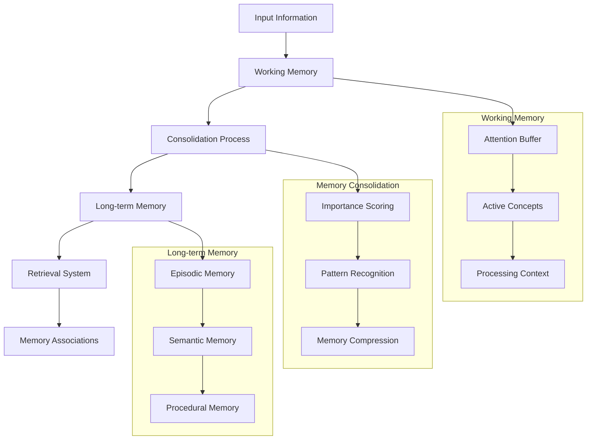

# Memory System

The Memory System forms the cognitive backbone of Brain AI, implementing a sophisticated multi-layered memory architecture that mimics human memory processes. It provides working memory for immediate processing, long-term memory for persistent storage, and advanced retrieval mechanisms that enable contextual understanding and learning over time.

## Overview

The Memory System is designed around the principle that intelligent behavior emerges from the interplay between immediate processing capabilities and accumulated experience. Unlike traditional databases or simple caching systems, this memory architecture incorporates temporal dynamics, importance weighting, and associative retrieval patterns that mirror biological memory systems.



## Core Architecture

### MemorySystem

The central orchestrator that manages all memory operations and coordinates between different memory types.

```rust
pub struct MemorySystem {
    working_memory: WorkingMemory,
    long_term_memory: LongTermMemory,
    consolidation_engine: ConsolidationEngine,
    retrieval_system: RetrievalSystem,
    attention_mechanism: AttentionMechanism,
    memory_capacity: usize,
    consolidation_threshold: f64,
    decay_rate: f64,
    config: MemoryConfig,
}

impl MemorySystem {
    /// Create a new memory system with specified capacity
    pub fn new(capacity: usize) -> Result<Self> {
        Ok(Self {
            working_memory: WorkingMemory::new(capacity / 10)?, // 10% for working memory
            long_term_memory: LongTermMemory::new(capacity)?,
            consolidation_engine: ConsolidationEngine::new()?,
            retrieval_system: RetrievalSystem::new()?,
            attention_mechanism: AttentionMechanism::new()?,
            memory_capacity: capacity,
            consolidation_threshold: 0.7,
            decay_rate: 0.01,
            config: MemoryConfig::default(),
        })
    }
    
    /// Store information in working memory
    pub fn store_working_memory(&mut self, item: MemoryItem) -> Result<MemoryId> {
        // Apply attention mechanism to determine importance
        let attention_score = self.attention_mechanism.calculate_attention(&item)?;
        let mut enhanced_item = item;
        enhanced_item.attention_score = attention_score;
        
        // Store in working memory
        let memory_id = self.working_memory.store(enhanced_item)?;
        
        // Check if consolidation is needed
        if self.should_consolidate()? {
            self.consolidate_memories().await?;
        }
        
        Ok(memory_id)
    }
    
    /// Retrieve memories based on query
    pub fn retrieve_memories(&self, query: &MemoryQuery) -> Result<Vec<MemoryItem>> {
        // Search working memory first (recency effect)
        let mut results = self.working_memory.search(query)?;
        
        // Search long-term memory
        let long_term_results = self.long_term_memory.search(query)?;
        results.extend(long_term_results);
        
        // Apply retrieval ranking
        results = self.retrieval_system.rank_results(results, query)?;
        
        // Apply memory decay
        results = self.apply_memory_decay(results)?;
        
        // Limit results based on query parameters
        if let Some(limit) = query.limit {
            results.truncate(limit);
        }
        
        Ok(results)
    }
}
```

### WorkingMemory

High-speed, limited-capacity memory for immediate processing and temporary storage.

```rust
pub struct WorkingMemory {
    items: HashMap<MemoryId, MemoryItem>,
    access_order: VecDeque<MemoryId>,
    capacity: usize,
    attention_buffer: AttentionBuffer,
    processing_context: ProcessingContext,
}

impl WorkingMemory {
    /// Store item in working memory with capacity management
    pub fn store(&mut self, item: MemoryItem) -> Result<MemoryId> {
        // Check capacity and evict if necessary
        if self.items.len() >= self.capacity {
            self.evict_least_important()?;
        }
        
        let memory_id = self.generate_memory_id();
        let mut stored_item = item;
        stored_item.id = memory_id;
        stored_item.created_at = SystemTime::now();
        stored_item.last_accessed = SystemTime::now();
        
        // Add to attention buffer if highly important
        if stored_item.importance > 0.8 {
            self.attention_buffer.add_item(&stored_item)?;
        }
        
        // Update processing context
        self.processing_context.update_with_item(&stored_item)?;
        
        // Store item
        self.items.insert(memory_id, stored_item);
        self.access_order.push_back(memory_id);
        
        Ok(memory_id)
    }
}
```

### LongTermMemory

Persistent storage with sophisticated organization and retrieval capabilities.

```rust
pub struct LongTermMemory {
    episodic_memory: EpisodicMemory,
    semantic_memory: SemanticMemory,
    procedural_memory: ProceduralMemory,
    associations: AssociationNetwork,
    indexing_system: MemoryIndexingSystem,
    compression_engine: CompressionEngine,
}

impl LongTermMemory {
    /// Store item in appropriate long-term memory subsystem
    pub fn store(&mut self, item: MemoryItem) -> Result<MemoryId> {
        let memory_id = self.generate_memory_id();
        let mut stored_item = item;
        stored_item.id = memory_id;
        
        // Determine memory type and store accordingly
        match stored_item.memory_type {
            MemoryType::Episodic => {
                self.episodic_memory.store(stored_item.clone())?;
            },
            MemoryType::Semantic => {
                self.semantic_memory.store(stored_item.clone())?;
            },
            MemoryType::Procedural => {
                self.procedural_memory.store(stored_item.clone())?;
            },
            MemoryType::Pattern => {
                // Store in semantic memory with pattern indexing
                self.semantic_memory.store_pattern(stored_item.clone())?;
            },
        }
        
        // Update indexing system
        self.indexing_system.index_item(&stored_item)?;
        
        Ok(memory_id)
    }
}
```
