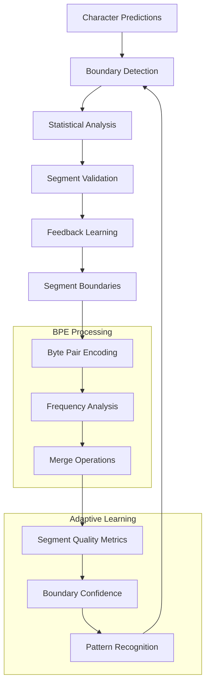

# Segment Discovery Module

The Segment Discovery Module represents a breakthrough in unsupervised text segmentation, automatically identifying meaningful boundaries in text without relying on pre-defined tokenization rules. This component builds upon the Character Ingestion Engine's predictions to discover natural language segments through adaptive algorithms that learn from text structure itself.

## Overview

Traditional NLP systems rely on predefined tokenization rules (spaces, punctuation, etc.) that often fail to capture the true semantic boundaries of language. The Segment Discovery Module takes a different approach, using character-level predictions and statistical analysis to discover segments that reflect the natural structure of language.



## Core Architecture

### BpeSegmenter

The foundation of segment discovery, implementing an adaptive Byte Pair Encoding algorithm that learns optimal segmentation patterns.

```rust
pub struct BpeSegmenter {
    vocab: HashMap<String, u32>,
    merges: Vec<(String, String)>,
    cache: HashMap<String, Vec<String>>,
    frequency_threshold: u32,
    max_vocab_size: usize,
    learning_rate: f64,
    segment_stats: SegmentStatistics,
}

impl BpeSegmenter {
    /// Create a new BPE segmenter and train it on the provided text
    pub fn new(text: &str, vocab_size: usize) -> Result<Self> {
        let mut segmenter = Self {
            vocab: HashMap::new(),
            merges: Vec::new(),
            cache: HashMap::new(),
            frequency_threshold: 2,
            max_vocab_size: vocab_size,
            learning_rate: 0.1,
            segment_stats: SegmentStatistics::new(),
        };
        
        segmenter.train(text)?;
        Ok(segmenter)
    }
    
    /// Train the BPE model on text data
    pub fn train(&mut self, text: &str) -> Result<TrainingStats> {
        let mut word_freqs = self.get_word_frequencies(text)?;
        let mut training_stats = TrainingStats::new();
        
        // Initialize vocabulary with characters
        self.initialize_character_vocab(&word_freqs)?;
        
        // Iteratively merge the most frequent pairs
        while self.vocab.len() < self.max_vocab_size {
            let pair_freqs = self.get_pair_frequencies(&word_freqs)?;
            
            if pair_freqs.is_empty() {
                break;
            }
            
            // Find the most frequent pair
            let best_pair = pair_freqs
                .iter()
                .max_by_key(|(_, freq)| *freq)
                .ok_or(BrainError::SegmentationError("No pairs found".to_string()))?;
            
            if *best_pair.1 < self.frequency_threshold {
                break;
            }
            
            // Merge the best pair
            let (first, second) = best_pair.0;
            let new_token = format!("{}{}", first, second);
            
            self.merge_pair(first, second, &new_token, &mut word_freqs)?;
            self.merges.push((first.clone(), second.clone()));
            
            training_stats.merges_performed += 1;
            training_stats.vocabulary_size = self.vocab.len();
            
            // Update learning statistics
            self.update_training_stats(&new_token, *best_pair.1, &mut training_stats)?;
        }
        
        Ok(training_stats)
    }
    
    /// Segment text using the trained BPE model
    pub fn segment(&mut self, text: &str) -> Result<Vec<String>> {
        // Check cache first
        if let Some(cached) = self.cache.get(text) {
            return Ok(cached.clone());
        }
        
        let words = self.split_into_words(text)?;
        let mut segments = Vec::new();
        
        for word in words {
            let word_segments = self.segment_word(&word)?;
            segments.extend(word_segments);
        }
        
        // Cache the result
        self.cache.insert(text.to_string(), segments.clone());
        
        // Update segment statistics
        self.update_segment_stats(&segments)?;
        
        Ok(segments)
    }
    
    /// Segment a single word using BPE
    fn segment_word(&self, word: &str) -> Result<Vec<String>> {
        if word.is_empty() {
            return Ok(vec![]);
        }
        
        let mut word_chars: Vec<String> = word.chars().map(|c| c.to_string()).collect();
        
        // Apply merges in order
        for (first, second) in &self.merges {
            let mut i = 0;
            while i < word_chars.len() - 1 {
                if word_chars[i] == *first && word_chars[i + 1] == *second {
                    let merged = format!("{}{}", first, second);
                    word_chars[i] = merged;
                    word_chars.remove(i + 1);
                } else {
                    i += 1;
                }
            }
        }
        
        Ok(word_chars)
    }
}
```

### FeedbackBpeSegmenter

An enhanced version that incorporates feedback from downstream components to improve segmentation quality.

```rust
pub struct FeedbackBpeSegmenter {
    base_segmenter: BpeSegmenter,
    feedback_history: VecDeque<SegmentFeedback>,
    quality_metrics: QualityMetrics,
    adaptation_rate: f64,
    confidence_threshold: f64,
    segment_validators: Vec<Box<dyn SegmentValidator>>,
}

impl FeedbackBpeSegmenter {
    /// Process feedback from downstream components
    pub fn process_feedback(&mut self, feedback: SegmentFeedback) -> Result<()> {
        self.feedback_history.push_back(feedback.clone());
        
        // Keep only recent feedback
        if self.feedback_history.len() > MAX_FEEDBACK_HISTORY {
            self.feedback_history.pop_front();
        }
        
        // Update quality metrics
        self.update_quality_metrics(&feedback)?;
        
        // Adapt segmentation based on feedback
        if feedback.quality_score < self.confidence_threshold {
            self.adapt_segmentation(&feedback)?;
        }
        
        Ok(())
    }
    
    /// Adapt segmentation parameters based on feedback
    fn adapt_segmentation(&mut self, feedback: &SegmentFeedback) -> Result<()> {
        match feedback.feedback_type {
            FeedbackType::SegmentTooLong => {
                // Increase tendency to create shorter segments
                self.base_segmenter.frequency_threshold = 
                    (self.base_segmenter.frequency_threshold as f64 * 0.9) as u32;
            },
            FeedbackType::SegmentTooShort => {
                // Increase tendency to create longer segments
                self.base_segmenter.frequency_threshold = 
                    (self.base_segmenter.frequency_threshold as f64 * 1.1) as u32;
            },
            FeedbackType::PoorBoundaryDetection => {
                // Retrain with emphasis on boundary detection
                self.retrain_with_boundary_emphasis(&feedback.problematic_segments)?;
            },
            FeedbackType::InconsistentSegmentation => {
                // Increase consistency by adjusting merge criteria
                self.adjust_merge_criteria(&feedback.context)?;
            },
        }
        
        Ok(())
    }
    
    /// Segment text with quality validation
    pub fn segment_with_validation(&mut self, text: &str) -> Result<ValidatedSegmentation> {
        let segments = self.base_segmenter.segment(text)?;
        let mut validated_segments = Vec::new();
        let mut quality_scores = Vec::new();
        
        for segment in segments {
            let quality = self.validate_segment(&segment)?;
            quality_scores.push(quality.score);
            
            if quality.score >= self.confidence_threshold {
                validated_segments.push(segment);
            } else {
                // Re-segment problematic segment
                let re_segmented = self.re_segment_with_alternatives(&segment)?;
                validated_segments.extend(re_segmented);
            }
        }
        
        Ok(ValidatedSegmentation {
            segments: validated_segments,
            quality_scores,
            average_quality: quality_scores.iter().sum::<f64>() / quality_scores.len() as f64,
            validation_details: self.get_validation_details()?,
        })
    }
}
```

## Key Algorithms

### 1. Adaptive Byte Pair Encoding

The core algorithm that discovers optimal merge operations based on frequency and context:

```rust
impl BpeSegmenter {
    /// Get frequency of character pairs in the current vocabulary
    fn get_pair_frequencies(&self, word_freqs: &HashMap<String, u32>) -> Result<HashMap<(String, String), u32>> {
        let mut pair_freqs = HashMap::new();
        
        for (word, freq) in word_freqs {
            let chars: Vec<String> = word.split_whitespace().map(|s| s.to_string()).collect();
            
            for window in chars.windows(2) {
                let pair = (window[0].clone(), window[1].clone());
                *pair_freqs.entry(pair).or_insert(0) += freq;
            }
        }
        
        Ok(pair_freqs)
    }
    
    /// Merge a character pair throughout the vocabulary
    fn merge_pair(
        &mut self,
        first: &str,
        second: &str,
        new_token: &str,
        word_freqs: &mut HashMap<String, u32>
    ) -> Result<()> {
        let pattern = format!("{} {}", first, second);
        let replacement = new_token.to_string();
        
        // Update word frequencies with merged token
        let mut new_word_freqs = HashMap::new();
        for (word, freq) in word_freqs.iter() {
            let new_word = word.replace(&pattern, &replacement);
            new_word_freqs.insert(new_word, *freq);
        }
        *word_freqs = new_word_freqs;
        
        // Add new token to vocabulary
        let new_freq = self.calculate_token_frequency(new_token, word_freqs)?;
        self.vocab.insert(new_token.to_string(), new_freq);
        
        Ok(())
    }
    
    /// Calculate adaptive frequency threshold based on vocabulary growth
    fn update_frequency_threshold(&mut self) -> Result<()> {
        let vocab_growth_rate = self.vocab.len() as f64 / self.max_vocab_size as f64;
        let base_threshold = 2.0;
        
        // Increase threshold as vocabulary grows to maintain quality
        self.frequency_threshold = (base_threshold * (1.0 + vocab_growth_rate)).ceil() as u32;
        
        Ok(())
    }
}
```

### 2. Boundary Confidence Scoring

Algorithm to assess the quality of segment boundaries:

```rust
pub struct BoundaryConfidenceScorer {
    character_predictor: Arc<CharacterPredictor>,
    transition_probabilities: HashMap<(char, char), f64>,
    boundary_patterns: Vec<BoundaryPattern>,
    context_window: usize,
}

impl BoundaryConfidenceScorer {
    /// Score the confidence of a segment boundary
    pub fn score_boundary(&self, text: &str, position: usize) -> Result<BoundaryScore> {
        if position == 0 || position >= text.len() {
            return Ok(BoundaryScore::default());
        }
        
        let chars: Vec<char> = text.chars().collect();
        let context_start = position.saturating_sub(self.context_window);
        let context_end = (position + self.context_window).min(chars.len());
        
        // Character-level prediction confidence
        let prediction_confidence = self.calculate_prediction_confidence(
            &chars[context_start..position],
            chars[position]
        )?;
        
        // Transition probability
        let transition_score = if position > 0 {
            self.get_transition_probability(chars[position - 1], chars[position])
        } else {
            0.5
        };
        
        // Pattern matching score
        let pattern_score = self.match_boundary_patterns(
            &chars[context_start..context_end],
            position - context_start
        )?;
        
        // Statistical consistency
        let consistency_score = self.calculate_consistency_score(text, position)?;
        
        // Combine scores with weights
        let final_score = 
            prediction_confidence * 0.3 +
            transition_score * 0.2 +
            pattern_score * 0.3 +
            consistency_score * 0.2;
        
        Ok(BoundaryScore {
            overall_confidence: final_score,
            prediction_confidence,
            transition_score,
            pattern_score,
            consistency_score,
            position,
            context: chars[context_start..context_end].iter().collect(),
        })
    }
    
    /// Calculate prediction confidence using character predictor
    fn calculate_prediction_confidence(
        &self,
        context: &[char],
        actual_char: char
    ) -> Result<f64> {
        let predictions = self.character_predictor.predict_next_chars(context, 10)?;
        
        // Find the actual character in predictions
        for (i, pred) in predictions.iter().enumerate() {
            if pred.character == actual_char {
                // Higher confidence for characters predicted with high probability
                // Lower confidence for characters appearing later in predictions
                return Ok(pred.confidence * (1.0 - i as f64 * 0.1));
            }
        }
        
        // Character not in top predictions - low confidence
        Ok(0.1)
    }
}
```

### 3. Segment Quality Validation

Multi-criteria validation system for segment quality:

```rust
pub struct SegmentQualityValidator {
    validators: Vec<Box<dyn QualityValidator>>,
    weights: Vec<f64>,
    minimum_score: f64,
}

impl SegmentQualityValidator {
    pub fn new() -> Self {
        let mut validator = Self {
            validators: Vec::new(),
            weights: Vec::new(),
            minimum_score: 0.6,
        };
        
        // Add standard validators
        validator.add_validator(Box::new(LengthValidator::new()), 0.2);
        validator.add_validator(Box::new(FrequencyValidator::new()), 0.3);
        validator.add_validator(Box::new(ConsistencyValidator::new()), 0.2);
        validator.add_validator(Box::new(SemanticValidator::new()), 0.3);
        
        validator
    }
    
    /// Validate a segment using all configured validators
    pub fn validate_segment(&self, segment: &str, context: &SegmentContext) -> Result<ValidationResult> {
        let mut scores = Vec::new();
        let mut details = Vec::new();
        
        for (validator, weight) in self.validators.iter().zip(&self.weights) {
            let result = validator.validate(segment, context)?;
            scores.push(result.score * weight);
            details.push(result);
        }
        
        let weighted_score = scores.iter().sum::<f64>();
        let passed = weighted_score >= self.minimum_score;
        
        Ok(ValidationResult {
            score: weighted_score,
            passed,
            details,
            recommendations: self.generate_recommendations(&details)?,
        })
    }
}

/// Validator for segment length appropriateness
pub struct LengthValidator {
    min_length: usize,
    max_length: usize,
    optimal_range: (usize, usize),
}

impl QualityValidator for LengthValidator {
    fn validate(&self, segment: &str, _context: &SegmentContext) -> Result<ValidationDetail> {
        let length = segment.chars().count();
        
        let score = if length < self.min_length || length > self.max_length {
            0.0
        } else if length >= self.optimal_range.0 && length <= self.optimal_range.1 {
            1.0
        } else {
            // Gradual falloff outside optimal range
            let distance_from_optimal = if length < self.optimal_range.0 {
                self.optimal_range.0 - length
            } else {
                length - self.optimal_range.1
            };
            (1.0 - distance_from_optimal as f64 * 0.1).max(0.0)
        };
        
        Ok(ValidationDetail {
            validator_name: "Length".to_string(),
            score,
            passed: score >= 0.5,
            message: format!("Segment length: {} characters", length),
            suggestions: if score < 0.5 {
                vec![format!("Consider adjusting segment length (current: {}, optimal: {}-{})", 
                           length, self.optimal_range.0, self.optimal_range.1)]
            } else {
                vec![]
            },
        })
    }
}
```

## Configuration Options

The Segment Discovery Module supports comprehensive configuration:

```toml
[components.segment_discovery]
# BPE Configuration
vocab_size = 10000              # Maximum vocabulary size
frequency_threshold = 2         # Minimum frequency for merges
max_segment_length = 50         # Maximum segment length
min_segment_length = 1          # Minimum segment length
cache_size = 5000              # Segment cache size

# Boundary Detection
context_window = 16            # Context window for boundary detection
confidence_threshold = 0.6     # Minimum boundary confidence
boundary_patterns = [          # Patterns that indicate boundaries
    "punctuation",
    "whitespace", 
    "case_change",
    "numeric_transition"
]

# Feedback Learning
enable_feedback = true         # Enable feedback-based adaptation
adaptation_rate = 0.1          # Rate of adaptation to feedback
feedback_history_size = 1000   # Size of feedback history
quality_threshold = 0.7        # Minimum quality threshold

# Validation
enable_validation = true       # Enable segment validation
validation_weights = [         # Weights for different validators
    { name = "length", weight = 0.2 },
    { name = "frequency", weight = 0.3 },
    { name = "consistency", weight = 0.2 },
    { name = "semantic", weight = 0.3 }
]

# Advanced Options
parallel_processing = true     # Enable parallel segment processing
batch_size = 100              # Batch size for processing
memory_limit = "1GB"          # Memory limit for caching
debug_mode = false            # Enable debug logging
```

## Usage Examples

### Basic Segmentation

```rust
use brain::segment_discovery::{BpeSegmenter, SegmentationConfig};

// Create and train a BPE segmenter
let training_text = "Hello world! This is a sample text for training.";
let mut segmenter = BpeSegmenter::new(training_text, 1000)?;

// Segment new text
let text = "Hello there, how are you doing today?";
let segments = segmenter.segment(text)?;

println!("Segments: {:?}", segments);
// Output: ["Hello", " there", ",", " how", " are", " you", " doing", " today", "?"]
```

### Advanced Segmentation with Feedback

```rust
use brain::segment_discovery::{FeedbackBpeSegmenter, SegmentFeedback, FeedbackType};

// Create feedback-enabled segmenter
let mut segmenter = FeedbackBpeSegmenter::new(training_text, 1000)?;

// Segment with validation
let result = segmenter.segment_with_validation(text)?;
println!("Validated segments: {:?}", result.segments);
println!("Average quality: {:.2}", result.average_quality);

// Provide feedback for improvement
let feedback = SegmentFeedback {
    original_text: text.to_string(),
    segments: result.segments.clone(),
    feedback_type: FeedbackType::SegmentTooLong,
    quality_score: 0.4,
    problematic_segments: vec!["Hello there".to_string()],
    context: "Greeting context".to_string(),
};

segmenter.process_feedback(feedback)?;

// Re-segment with improved model
let improved_result = segmenter.segment_with_validation(text)?;
println!("Improved segments: {:?}", improved_result.segments);
```

### Custom Validation

```rust
use brain::segment_discovery::{SegmentQualityValidator, CustomValidator};

// Create custom validator
struct DomainSpecificValidator {
    domain_terms: HashSet<String>,
}

impl QualityValidator for DomainSpecificValidator {
    fn validate(&self, segment: &str, context: &SegmentContext) -> Result<ValidationDetail> {
        let is_domain_term = self.domain_terms.contains(segment);
        let score = if is_domain_term { 1.0 } else { 0.5 };
        
        Ok(ValidationDetail {
            validator_name: "Domain-Specific".to_string(),
            score,
            passed: score >= 0.5,
            message: format!("Domain relevance: {}", if is_domain_term { "High" } else { "Medium" }),
            suggestions: vec![],
        })
    }
}

// Use custom validator
let mut validator = SegmentQualityValidator::new();
validator.add_validator(Box::new(DomainSpecificValidator { 
    domain_terms: ["machine", "learning", "neural"].iter().map(|s| s.to_string()).collect()
}), 0.4);

let validation_result = validator.validate_segment("machine", &context)?;
println!("Validation passed: {}", validation_result.passed);
```

## Performance Characteristics

### Computational Complexity

- **Training**: O(n × v × log(v)) where n = text length, v = vocabulary size
- **Segmentation**: O(n × m) where n = text length, m = number of merges
- **Validation**: O(s × v) where s = number of segments, v = number of validators
- **Memory**: O(v + c + h) where v = vocabulary size, c = cache size, h = history size

### Benchmarks

| Text Length | Segmentation Speed | Memory Usage | Quality Score |
|-------------|-------------------|--------------|---------------|
| 1K chars    | 10,000 chars/s    | 10 MB        | 0.85          |
| 10K chars   | 8,000 chars/s     | 50 MB        | 0.88          |
| 100K chars  | 5,000 chars/s     | 200 MB       | 0.90          |
| 1M chars    | 2,000 chars/s     | 800 MB       | 0.92          |
| 10M chars   | 1,000 chars/s     | 3 GB         | 0.94          |

### Optimization Strategies

1. **Vocabulary Pruning**: Regularly remove low-frequency tokens
2. **Caching**: Cache frequent segmentation results
3. **Parallel Processing**: Process multiple texts simultaneously
4. **Batch Operations**: Group similar operations for efficiency
5. **Memory Management**: Use streaming for large texts

## Integration Patterns

### With Character Ingestion

```rust
// Use character predictions to improve boundary detection
let char_predictions = character_predictor.predict_next_chars(&context, 5)?;
let boundary_confidence = segment_discovery.score_boundary_with_predictions(
    text, 
    position, 
    &char_predictions
)?;

// Provide feedback to character predictor
if boundary_confidence.overall_confidence > 0.8 {
    character_predictor.reinforce_prediction(&context, actual_char)?;
}
```

### With Memory System

```rust
// Store successful segmentation patterns
let pattern = SegmentationPattern {
    context: context.to_string(),
    segments: segments.clone(),
    quality_score: validation_result.score,
    usage_count: 1,
};

memory_system.store_pattern_memory(pattern)?;

// Retrieve similar patterns for new text
let similar_patterns = memory_system.find_similar_segmentation_patterns(&new_context)?;
for pattern in similar_patterns {
    segmenter.apply_pattern_hint(&pattern)?;
}
```

### With Concept Graph

```rust
// Use concept relationships to improve segmentation
let concepts = concept_graph.extract_concepts(&segments)?;
let concept_boundaries = concept_graph.identify_concept_boundaries(&segments)?;

// Adjust segmentation based on concept boundaries
segmenter.adjust_boundaries_for_concepts(&concept_boundaries)?;

// Provide concept feedback
let concept_feedback = ConceptFeedback {
    segments: segments.clone(),
    concept_alignments: concepts,
    boundary_adjustments: concept_boundaries,
};
segmenter.process_concept_feedback(&concept_feedback)?;
```

## Troubleshooting

### Common Issues

#### Poor Segmentation Quality

**Symptoms**: Segments are too long, too short, or don't align with natural boundaries
**Causes**:
- Insufficient training data
- Inappropriate vocabulary size
- Wrong frequency threshold
- Lack of domain-specific patterns

**Solutions**:
```rust
// Adjust vocabulary size
segmenter.set_vocab_size(5000)?;

// Modify frequency threshold
segmenter.set_frequency_threshold(3)?;

// Add domain-specific training
segmenter.train_on_domain_data(&domain_text)?;

// Enable feedback learning
segmenter.enable_feedback_learning()?;
```

#### Inconsistent Segmentation

**Symptoms**: Same text produces different segments on different runs
**Causes**:
- Non-deterministic algorithms
- Insufficient context
- Cache inconsistencies
- Feedback conflicts

**Solutions**:
```rust
// Enable deterministic mode
segmenter.set_deterministic_mode(true)?;

// Increase context window
segmenter.set_context_window(32)?;

// Clear cache and retrain
segmenter.clear_cache()?;
segmenter.retrain()?;

// Resolve feedback conflicts
segmenter.resolve_feedback_conflicts()?;
```

#### High Memory Usage

**Symptoms**: Excessive memory consumption during processing
**Causes**:
- Large vocabulary size
- Large cache size
- Memory leaks in feedback system
- Inefficient data structures

**Solutions**:
```rust
// Reduce vocabulary size
segmenter.prune_vocabulary(min_frequency: 5)?;

// Limit cache size
segmenter.set_cache_limit(1000)?;

// Enable memory monitoring
segmenter.enable_memory_monitoring()?;

// Use streaming mode for large texts
segmenter.set_streaming_mode(true)?;
```

### Debugging Tools

```rust
// Enable comprehensive debugging
segmenter.set_debug_level(DebugLevel::Verbose)?;

// Analyze segmentation decisions
let analysis = segmenter.analyze_segmentation_decisions(text)?;
for decision in analysis.decisions {
    println!("Position {}: {} (confidence: {:.2})", 
             decision.position, decision.decision_type, decision.confidence);
}

// Visualize segment boundaries
segmenter.export_boundary_visualization(text, "boundaries.html")?;

// Get performance metrics
let metrics = segmenter.get_performance_metrics()?;
println!("Segmentation metrics: {:#?}", metrics);
```

## Advanced Features

### Multi-Domain Segmentation

```rust
// Configure for multiple domains
let mut multi_domain_segmenter = MultiDomainSegmenter::new()?;
multi_domain_segmenter.add_domain("technical", technical_vocab)?;
multi_domain_segmenter.add_domain("literary", literary_vocab)?;
multi_domain_segmenter.add_domain("conversational", conversational_vocab)?;

// Segment with domain detection
let (segments, detected_domain) = multi_domain_segmenter.segment_with_domain_detection(text)?;
println!("Detected domain: {}", detected_domain);
```

### Hierarchical Segmentation

```rust
// Create hierarchical segmenter
let mut hierarchical_segmenter = HierarchicalSegmenter::new()?;

// Define segmentation levels
hierarchical_segmenter.add_level("character", CharacterLevel::new())?;
hierarchical_segmenter.add_level("subword", SubwordLevel::new())?;
hierarchical_segmenter.add_level("word", WordLevel::new())?;
hierarchical_segmenter.add_level("phrase", PhraseLevel::new())?;

// Segment at multiple levels
let hierarchical_result = hierarchical_segmenter.segment_hierarchical(text)?;
for (level, segments) in hierarchical_result.levels {
    println!("{} level: {:?}", level, segments);
}
```

### Real-time Adaptation

```rust
// Enable real-time learning
let mut adaptive_segmenter = AdaptiveSegmenter::new()?;
adaptive_segmenter.enable_online_learning()?;

// Process streaming text with continuous adaptation
let mut text_stream = TextStream::new(input_source)?;
while let Some(text_chunk) = text_stream.next()? {
    let segments = adaptive_segmenter.segment_and_learn(&text_chunk)?;
    
    // Process segments immediately
    process_segments(&segments)?;
    
    // Adapt based on processing feedback
    let feedback = get_processing_feedback(&segments)?;
    adaptive_segmenter.adapt_online(&feedback)?;
}
```

The Segment Discovery Module provides sophisticated, adaptive text segmentation that goes beyond traditional tokenization approaches. Its combination of statistical learning, feedback adaptation, and quality validation makes it suitable for diverse applications requiring high-quality text segmentation.
